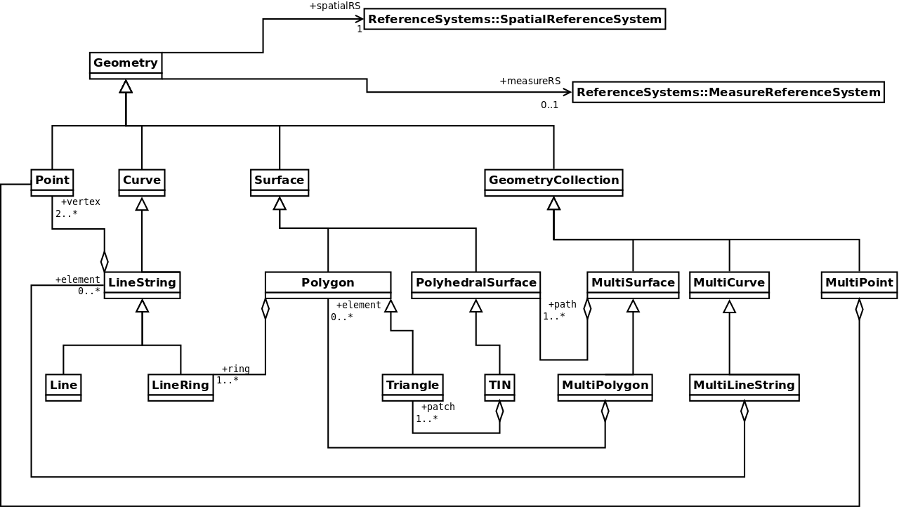

****
Úvod
****

Databáze
--------

Kdy ukládat data do databáze?
=============================

.. index::
   single: zdroje dat
	   
V geoinformatické praxi pracujeme se třemi typy zdrojů dat. V prvé
řadě se jedná o data uložená v souborovém systému. Hovoříme-li o
vektorových datech, tak může jít typicky o data v zastaralém, leč
stále nejpoužívanějším formátu :wikipedia-en:`Esri Shapefile`,
případně :wikipedia-en:`OGC GML <Geography Markup Language>`. Dalším
typem jsou webové služby, jmenovitě :skoleni:`OGC WFS <open-source-gis/standardy/ogc/wfs.html>` (Web Feature Service). V případě WFS si aplikace
vyžádá pomocí souboru ve značkovacím jazyce :wikipedia-en:`XML` data
na vzdáleném serveru po síti. Posledním typem uložení dat, kterému je
věnováno toto školení, je databáze. Většina současných databází, ať
již open source nebo ryze proprietárních, podporuje v nějaké míře
ukládání a dotazování prostorových prvků.  Ať už :wikipedia:`MySQL`,
:wikipedia:`Oracle`, nebo :wikipedia:`MSSQL` a v neposlední řadě
:wikipedia:`PostgreSQL`, kterému je věnován tento kurz.

.. noteadvanced:: Hranice mezi jednotlivými typy zdrojů dat nemusí být
   vždy jednoznačná. Existují například takzvané `souborové databáze`,
   tedy soubory, které se chovají podobným způsobem jako databázový
   server, ovšem bez řady výhod, které poskytuje plnohodnotný
   databázový systém. Na druhou stranu se s nimi o poznání snáze
   manipuluje. Příkladem může být :wikipedia:`MS Access` nebo open
   source :wikipedia:`SQLite` (a jeho prostorové nadstavby
   :wikipedia-en:`OGC GeoPackage <GeoPackage>` a
   :wikipedia-en:`SpatiaLite`).

Provoz databáze přináší ve srovnání s daty v souborech určité
požadavky na režii. O její správu a nastavení se musí starat
kvalifikovaný specialista, má určité nároky na hardware apod. Co nám
tedy přináší a kdy je pro nás nezastupitelná?

V první řadě je třeba vzít v potaz objem dat. Od jistého objemu není 
možné efektivně pracovat s daty uloženými v souborech. Naproti tomu v
databázi můžeme pomocí indexů přistupovat přímo k jednotlivým záznamům
tak, jak jsou uloženy na datových stránkách.

.. index::
   single: referenční integrita

Referenční integrita
^^^^^^^^^^^^^^^^^^^^

Další benefit, který nám databáze může přinést je "hlídání" tzv. `referenční
integrity`.

Referenční integrita znamená, že tabulky jsou mezi sebou provázány cizími
klíči. Tedy pokud podřízená (slave) tabulka obsahuje položku s odkazy do
jiné `nadřízené` tabulky, není možné do podřízené tabulky přidat záznam,
pokud v nadřízené tabulce neexistuje hodnota, na kterou odkazuje cizí klíč.
Nemůžeme tedy například do tabulky jednotlivých vozidel přidat vozidlo s
odkazem na typ `tříkolka`, pokud nemáme v tabulce typů vozidel typ `tříkolka`.
Nebo pokud máme tabulku staveb a parcel, při správně
nastavené referenční integritě nám databáze nedovolí vložit budovu na
neexistující parcele a pod.

Další užitečnou vlastnosti je možnost nastavit chování podřízeného
záznamu při smazání souvisejícího záznamu v nadřízené tabulce. Můžeme
zvolit :sqlcmd:`RESTRICT` nebo :sqlcmd:`CASCADE`. V případě :sqlcmd:`CASCADE` se
související záznamy mažou, v případě :sqlcmd:`RESTRICT` není možné nadřízený
záznam smazat, dokud jsou na něj navázány záznamy v podřízených
tabulkách.

Spolupráce
^^^^^^^^^^

Není obvyklé, aby k jednomu souboru přistupovalo více klientských aplikací
zároveň, protože by si ho přepisovaly "pod rukama". Databáze je v tomhle daleko
pokročilejší a umožňuje, aby nad jednou datovou sadou mohlo pracovat více klientů
najednou. V databázi je navíc možné nastavovat práva na zápis, čtení a manipulaci
s tabulkami, schématy, funkcemi... Podobně jako v souborovém systému.

.. index::
   single: referenční integrita
   single: ACID

Transakce
^^^^^^^^^

Transakčnost databáze znamená, že se série změn provede buď celá nebo vůbec.
Typická (a tím pádem pěkně otřepaný případ) je situace, kdy převádíme peníze z
účtu na účet. Tedy, nebylo by dobré, aby byly z jednoho účtu peníze odečteny, aniž by na
cílový účet byly přidány.

Seznam požadavků na transakční databázi bývá označován zkratkou
:wikipedia:`ACID`. Znamená to `Atomic, Consistent, Isolated,
Durable`. Znamená to, že transakce je nedělitelná, před i po jejím
proběhnutí musí být platná referenční integrita, transakce se navzájem
neovlivňují a změny jsou trvalé i po případné havárii databázového
serveru.

Co je databáze?
---------------

Databázi, ať už relační nebo dokumentovou, si můžeme představit jako 
knihovnu. V knihách (tabulkách) máme nějaké informace. Informace pro nás 
vyhledávají knihovnice (obslužné programy). K tomu používají katalogy a 
rejstříky (indexy). Organizace knihovny je plně pod naší kontrolou, 
ovlivňujeme hardware (kolik bude mít budova pater (disků), kolik bude 
volných regálů a manipulačního prostoru atd.), kolik bude mít knihovna 
fyzických zaměstnanců (počet jader procesoru). Dále ovlivňujeme 
organizaci, budou knihy řazeny podle abecedy podle názvů, podle klíčových 
slov, podle jména autora? Jak často budeme aktualizovat katalogy a 
rejstříky (aktualizovat indexy)? Kolik místa vlastně na katalogy/indexy 
vyhradíme? Jak budeme nakládat s místem po vyřazených svazcích (proces 
:sqlcmd:`VACUUM`)? A tak dále. Se svými zaměstnanci komunikujeme v jazyce :doc:`SQL <3_jazyk_sql>` (pokud 
tedy hovoříme o relační databázi).

.. index::
   single: tabulka

Tabulky
=======

V relační databázi ukládáme data do tabulek (tzv. relací). Tabulka je
svisle dělena na jednotlivé sloupce (často označovány jako atributy
nebo položky) a vodorovně na řádky (záznamy).  Data v jednom sloupci
musí mít stejný `datový typ` (datum, celé číslo, číslo s plovoucí
desetinnou čárkou, textový řetězec apod.).

.. index::
   single: schéma

Schémata
========

Schémata můžeme vnímat podobně jako adresářovou strukturu, ovšem bez
možnosti dalšího zanořování, případně jako `jmenný prostor`. Umožňuje
nám logicky dělit databázi, což oceníme například při zálohování, při
nastavování práv. Databázové tabulky, funkce, indexy apod. musí mít v
rámci schématu (schéma je možné vnímat jako součást názvu) unikátní
název. Tudíž můžeme mít v databázi stejně pojmenované tabulky v
různých schématech. Příklad využití je napříkad při databázi rozdělené
do schémat geograficky. Další výhodné využití je při historizování
záznamů, kdy máme schéma `historie` s podobnou strukturou jako schéma
s platnými daty.

.. index::
   single: datové typy

Datové typy
===========

Datové typy odpovídají typům z programovacích jazyků typu C. Základem jsou celočíselné
typy (`integer`, `bigint` apod.) a řetězce (`varchar`, `char`, `text` ...), tím ovšem výčet
zdaleka nekončí. Pro prostorovou reprezentaci používáme datový typ `geometry` nebo
`geography`. Záznamu v tabulce odpovídají kompozitní typy, celé datové struktury je
možné ukládat do `nerelačních datových typů` jako je :wikipedia:`JSON`, `hstore <http://www.postgresql.org/docs/current/static/hstore.html>`_ nebo :wikipedia:`XML`
a dalo by se dále pokračovat.

.. index::
   single: index
   single: B-tree

.. _indexy:

Indexy
======

Indexy v databázi slouží k co možná nejrychlejšímu dohledání 
záznamů v tabulce. Fungují na podobném principu jako rejstřík v knize. Jedná se o 
jakýsi utříděný seznam klíčů spojených s odkazem na konkrétní 
datovou stránku, na místo na pevném disku, kde je uložena požadovaná 
informace. Smyslem indexu je provést při dohledání záznamu minimum 
porovnání hodnot v indexu s požadovanou hodnotou. U neindexované tabulky 
bychom museli porovnat požadovanou hodnotu se všemi záznamy.

.. noteadvanced:: Nejčastějším typem indexu je :wikipedia-en:`B-tree`, zde jsou hodnoty 
   uloženy ve stromovité struktuře založené na dichotomickém větvení. Na 
   každém uzlu porovnáme požadovanou hodnotu s hodnotou na uzlu a zjistíme, 
   jestli je větší nebo menší. S každým patrem je síto jemnější. To je 
   velice efektivní, když si uvědomíme, že při zdvojnásobení objemu dat 
   přibude jen jedno porovnání navíc. B-tree index je možné sestavit jen nad
   položkami s takovým typem dat, který je možné porovnávat pomocí operátorů
   ``<`` a ``>``. Nehodí se tedy pro data vícedimenzionální, např. prostorová data.

.. index::
   single: omezení
   single: constraints

Omezení (constraints)
=====================

V odstavci věnovaném referenční integritě je zmíněno, že není možné vložit do sloupce s cizím
klíčem hodnotu, která není v `nadřízené` tabulce. To je příkladem `omezení cizího klíče`. Dalším
častým příkladem je omezení na unikátní hodnotu, což je podmínka pro `primární klíč`, tedy
hodnotu, podle které je možné jednoznačně identifikovat záznam v tabulce. Omezení ovšem můžeme vytvářet dle
libosti, například můžeme v tabulce osob nastavit, že není možné do sloupce se jménem vložit jméno
`František`, případně do nějakého číselného sloupce hodnotu, která není dělitelná jedenácti, geometrii
s rozlohou větší než hektar apod.

Zde je dobré si uvědomit, že pokud se pokusíte vložit data do sloupce a porušíte omezení, vrátí server
chybu. Pokud tedy bude tato dávka součástí transakce, neprovede se celá transakce.

.. index::
   single: pohled
   single: view

Pohledy (views)
===============

:pgsqlcmd:`Pohledy <sql-createview>` jsou uložené dotazy, které se chovají obdobně jako tabulky.
Můžeme je dotazovat, nastavovat jim práva. K tabulkám, do kterých pohledy nahlížejí, přistupují s právy
toho, kdo je vytvořil. Můžeme tedy pohledem zpřístupnit pro některé uživatele vybraný obsah
tabulek, které sami nevidí.

Specifickou záležitostí jsou :pgsqlcmd:`materializované pohledy <sql-creatematerializedview>`.
Zde je výstup dotazu uložen do tabulky a zároveň je uložen dotaz, kterým byl materializovaný
pohledy vygenerován. Proto může být snadno přegenerován příkazem
:pgsqlcmd:`REFRESH MATERIALIZE VIEW <sql-refreshmaterializedview>`.

.. note:: Materializované pohledy podporuje PostgreSQL od verze 9.3.

.. index::
   single: trigger
   single: DML
   single: DLL

Triggery
========

:pgsqlcmd:`Trigger <sql-createtrigger>`, neboli spoušť spustí proceduru při nějaké události.
Existují dva základní typy triggerů a to `DML` a `DDL` triggery.

**DML**, tedy `Data Manipulation Language` trigger se spustí při manipulaci s daty, tedy při vložení, smazání, případně
aktualizaci záznamu. Obvyklé využití je například archivování smazávaných hodnot, kontrolu dat při vstupu a podobně.
Pomocí triggerů lze ošetřit také kontrolu podobně jako u omezení. Pokud nastavíme trigger tak, aby se spustil před vložením
záznamu, můžeme eliminovat duplicitní záznamy, dříve než dojde k chybě a tím pádem nedojde k pádu transakce.

**DDL**, tedy `Data Definition Language` trigger je v PostgreSQL relativně čerstvá novinka a spustí se při změně ve struktuře,
například při přidání tabulky může nastavit práva, replikace apod.

Obdobou triggerů jsou :pgsqlcmd:`pravidla <sql-createrule>`, ta ovšem nedisponují všemi možnostmi triggerů a nedoporučuje
se jich příliš používat. Nicméně občas se mohou hodit, pokud chceme pracovat s pohledem jako s tabulkou a nastavit,
co se má dít při vkládání nebo manipulaci s daty.

.. index::
   single: funkce

Funkce
======

:pgsqlcmd:`Funkce <sql-createfunction>` je v databázi uložená procedura, kterou spustíme dotazem. V PostgreSQL může
být napsaná v jazyce SQL, v procedurálním jazyce PosgreSQL PL/pgSQL :pgsqlcmd:`plpgsql` či v dalším z jazyků, které
PostgreSQL podporuje jako je Python, Perl, R, Javascript a další. Případně může být importovaná z externího modulu napsaného
například v jazyce C.

Funkce tedy spouští nějaký kód, může vracet jednu hodnotu, jednu hodnotu z více záznamů (agregační funkce), případně
může vracet více záznamů, nebo provádět nějaké změny v databázi (například funkce PostGISu :pgiscmd:`AddGeometryColumn`). Specifickou
skupinou jsou analytické :pgsqlcmd:`window funkce <tutorial-window>`.

Nastavování práv k funkcím je složitější než u pohledů, je možno nastavit :sqlcmd:`SECURITY DEFINER` práva a potom
přistupuje funkce k tabulkám s právy svého tvůrce.

.. _prostorova_db:

.. index::
   single: prostorová databáze

A co prostorová databáze?
-------------------------

Prostorová databáze se podobá takové knihovně, ve které jsou kromě knih
také mapy, atlasy, globusy... Zkrátka nosiče informací, které 
zaznamenávají také umístění jednotlivých údajů.

PostGIS používá pro popis prostorových objektů specifikaci OGC `Simple
Features Access <http://www.opengeospatial.org/standards/sfa>`_
(SFA). Tato specifikace popisuje společnou architekturu pro
*tzv. jednoduché geoprvky* a specifikuje jejich uložení v digitální
podobě.

.. note:: V roce 2004 byla specifikace OGC SFA přijata jako
	  mezinárodní norma označovaná jako ISO 19125 a později v roce
	  2006 adoptována jako technická norma ČSN 19125.

Specifikace OGC SFA zavádí pro popis geometrie geoprvků nové datové
typy jako je např. *Point*, *LineString*, *Polygon* a další.

   
   Přehled jednotlivých typů geometrie dle specifikace OGC SFA.
