Začínáme
========

Na úvod si ukážeme přístup k datům uložených v databázi z prostředí
:program:`QGIS`.

Zobrazujeme data v QGIS
-----------------------

.. _qgis-add-pg-layer:

Vektorová data uložená v geodatabázi PostGIS je možné načíst buď z *menu*

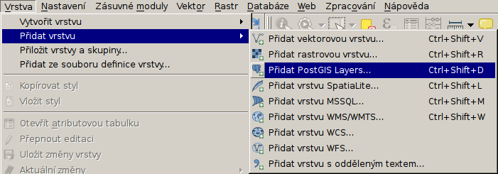

anebo z *nástrojové lišty* aplikace QGIS. Další možností je použít
:ref:`datový katalog <DataCatalog>`.

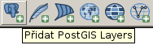

.. _db-connection:

V dialogu nejprve nadefinujeme parametry připojení k databázi.

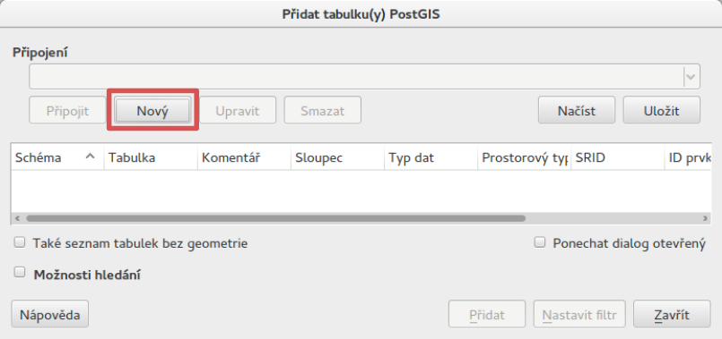

Nastavíme:

* název spojení :fignote:`(1)`
* hostitel (adresa serveru, pokud je to localhost, nemusíme vyplňovat) :fignote:`(2)`
* databáze, ke které se chceme připojit :fignote:`(3)`
* uživatelské jméno a heslo pro připojení k databázi :fignote:`(4)`

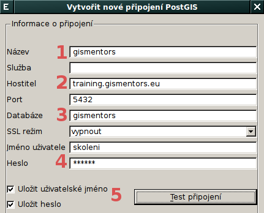

Pro opětovné připojení je vhodné si uživatelské jméno a popřípadě i
heslo (v tomto případě bude heslo uloženo na lokálním disku v textovém
souboru!) uložit :fignote:`(5)`

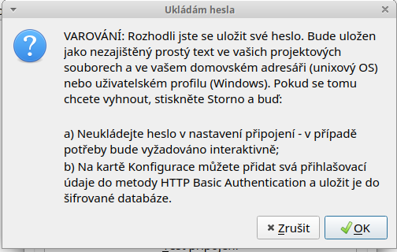

Nastavení připojení k databázi nejprve otestujeme :fignote:`(6)` a
poté potvrdíme.

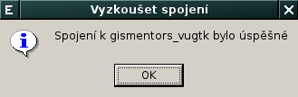

.. notecmd:: Připojení k databázi

   .. code-block:: bash
      
      psql gismentors -U skoleni -W -h training.gismentors.eu

Následně se již můžeme k databázi připojit

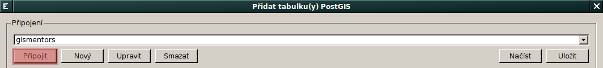

a vybrat vektorové vrstvy :fignote:`(1)`, které chceme z geodatabáze
načíst :fignote:`(2)`.

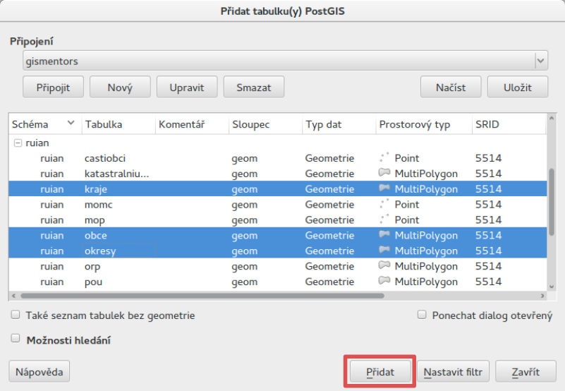

.. _DataCatalog:

Alternativní postup (datový katalog)
^^^^^^^^^^^^^^^^^^^^^^^^^^^^^^^^^^^^

Připojení k databázi PostGIS je možné definovat i v rámci *datového
katalogu (prohlížeče)*.

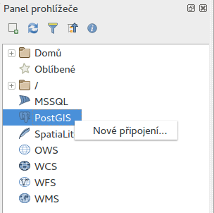

Vektorovou vrstvu z geodatabáze PostGIS přetáhneme z datového katalogu
do okna *Vrstvy*.

.. figure:: ../images/../images/qgis-catalog-layer.png
	    :class: small

Editujeme vektorová data
------------------------

:program:`QGIS` umožňuje editaci různých formátů vektorových dat
včetně dat uložených v geodatabázi PostGIS. Přepnout danou vektorovou
vrstvu do *editačního módu* je možné z kontextového menu

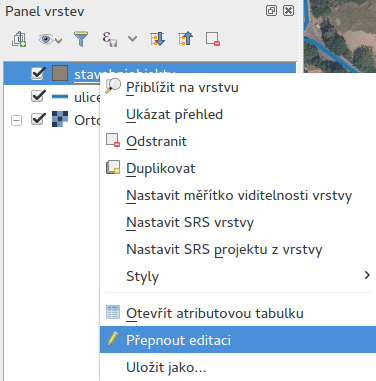

anebo *nástrojové lišty* QGISu.

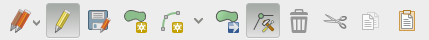

Po přepnutí do editačního módu se vektorová vrstva zobrazí včetně
lomových bodů (červené křížky).

.. figure:: ../images/qgis-edit-mode.png
            :width: 800px

**Editační nástrojová lišta** QGISu umožňuje

.. table::
   :class: toc

   +-----+-------------------------------------------------+
   | |A| |  přidávat nové prvky                            |
   +-----+-------------------------------------------------+
   | |M| |  přesunovat existující prvky                    |
   +-----+-------------------------------------------------+
   | |N| |  modifikovat uzly (přidávat, mazat a přesunovat)|
   +-----+-------------------------------------------------+
   | |D| |  smazat vybrané prvky                           |
   +-----+-------------------------------------------------+
   | |C| |  vyjmout vybrané prvky                          |
   +-----+-------------------------------------------------+
   | |O| |  kopírovat vybrané prvky                        |
   +-----+-------------------------------------------------+
   | |P| |  vložit prvky                                   |
   +-----+-------------------------------------------------+

.. |A| image:: ../images/qgis-edit-add.png
               :width: 32px
               :align: middle

.. |M| image:: ../images/qgis-edit-move.png
               :width: 32px
               :align: middle

.. |N| image:: ../images/qgis-edit-node.png
               :width: 32px
               :align: middle

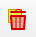

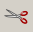

Příklad přidání nového prvku
^^^^^^^^^^^^^^^^^^^^^^^^^^^^

Z nástrojové lišty vybereme nástroj pro *přidávání nového prvku*.

Lomové body nového prvku volíme stisknutím levého tlačítka
myši. Poslední uložený lomový bod můžeme vrátit zpět pomocí klávesy
:kbd:`Backspace`.

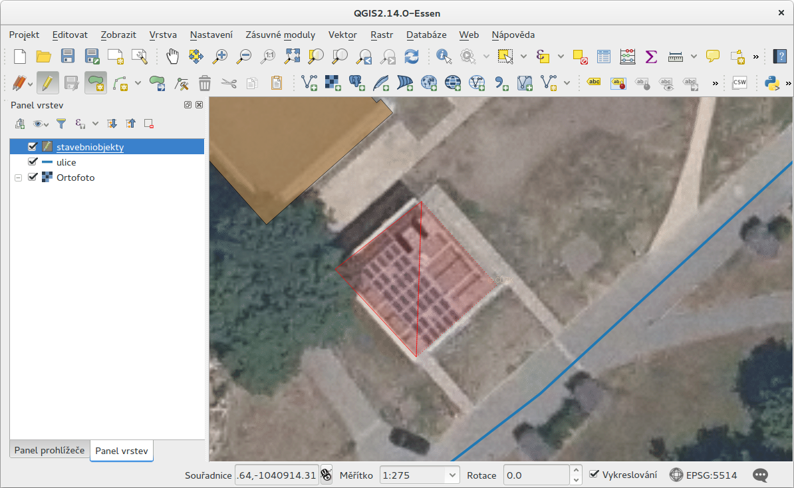

Editaci prvku ukončíme stisknutím pravého tlačítka myši. V posledním
kroku můžeme vyplnit atributy nově přidaného prvku.

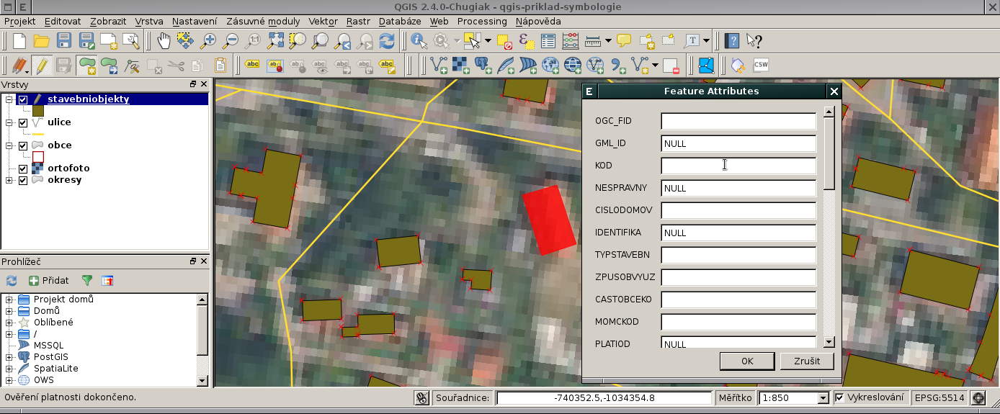

.. note:: Více k editace v `manuálu
          <http://docs.qgis.org/2.2/en/docs/user_manual/working_with_vector/editing_geometry_attributes.html>`_
          QGISu.

