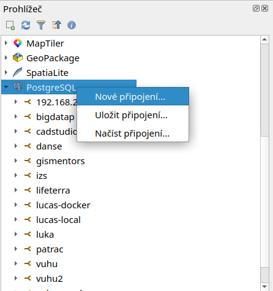
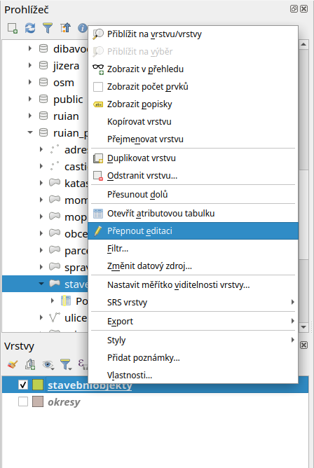

Začínáme
========

Na úvod si ukážeme přístup k datům uložených v databázi z prostředí
desktopového programu `QGIS <http://www.qgis.org>`_.

.. note:: Více o tomto programu se dozvíte na :skoleni:`školení QGIS
          pro začátečníky <qgis-zacatecnik>`.

.. index::
   single: zobrazení dat
   single: QGIS

Zobrazujeme data v QGIS
-----------------------

.. _qgis-add-pg-layer:

Vektorová data uložená v geodatabázi PostGIS je možné načíst buď z
menu :menuselection:`Vrstva --> Přidat vrstvy --> Přidat vrstvu
PostGIS` anebo z *nástrojové lišty* aplikace QGIS
|mActionAddPostgisLayer|. Další možností je použít :ref:`datový
katalog <DataCatalog>`.

.. _db-connection:

Objeví se dialog, ve které definujeme parametry *nové* připojení k
databázi.

.. figure:: ../images/qgis-postgis-new.png
   :class: middle
   :scale-latex: 65
	      
Nastavíme:

* název spojení :fignote:`(1)`
* hostitel (adresa serveru, pokud je to localhost, nemusíme vyplňovat) :fignote:`(2)`
* databáze, ke které se chceme připojit :fignote:`(3)`
* uživatelské jméno a heslo pro připojení k databázi :fignote:`(4)`

.. raw:: latex

   \newpage

.. figure:: ../images/qgis-postgis-new-settings.png
           :width: 350px
           :scale-latex: 50

.. note:: Při opětovném připojení je vhodné si uživatelské jméno a
	  popřípadě i heslo uložit na lokální disk. V tomto případě
	  nás QGIS upozorní, že ukládáme přihlašovací údaje do
	  nešifrovaného souboru.

	  .. figure:: ../images/qgis-pg-conn-warning.png
		      :class: small

Nastavení připojení k databázi nejprve otestujeme a poté potvrdíme.

.. noteadvanced:: **Připojení k databázi z příkazové řádky**

   .. code-block:: bash
      
      psql gismentors -U skoleni -W -h training.gismentors.eu

Následně se již můžeme k databázi *připojit*

.. figure:: ../images/qgis-postgis-connect.png
   :class: middle
   :scale-latex: 80
                 
a vybrat vektorové vrstvy, které chceme z geodatabáze *načíst*.

.. figure:: ../images/qgis-postgis-layers.png
           :width: 700px

.. raw:: latex

   \newpage

.. _DataCatalog:

Datový prohlížeč
^^^^^^^^^^^^^^^^

Připojení k databázi PostGIS je možné definovat i v rámci *datového
katalogu (prohlížeče)*.

	   
Po připojení k databázi vybranou vektorovou vrstvu jednoduše
přetáhneme z datového katalogu do mapového okna.

.. figure:: ../images/../images/qgis-catalog-layer.png
   :class: middle
   :scale-latex: 75

.. index::
   single: editace dat
   single: QGIS

Editujeme vektorová data
------------------------

QGIS umožňuje editaci různých formátů vektorových dat včetně dat
uložených v geodatabázi PostGIS. Přepnout danou vektorovou vrstvu do
*editačního módu* je možné z kontextového menu

anebo *nástrojové lišty* QGISu |mIconEditable|.

Po přepnutí do editačního módu se vektorová vrstva zobrazí včetně
lomových bodů (červené křížky).

.. figure:: ../images/qgis-edit-mode.png
   :width: 800px
   :scale-latex: 85
	      
**Editační nástrojová lišta** QGISu umožňuje

.. figure:: ../images/qgis-edit-toolbar.png
            :width: 350px

.. table::
   :class: toc

   +-----+-------------------------------------------------+
   | |A| |  přidávat nové prvky                            |
   +-----+-------------------------------------------------+
   | |M| |  přesunovat existující prvky                    |
   +-----+-------------------------------------------------+
   | |N| |  modifikovat uzly (přidávat, mazat a přesunovat)|
   +-----+-------------------------------------------------+
   | |D| |  smazat vybrané prvky                           |
   +-----+-------------------------------------------------+
   | |C| |  vyjmout vybrané prvky                          |
   +-----+-------------------------------------------------+
   | |O| |  kopírovat vybrané prvky                        |
   +-----+-------------------------------------------------+
   | |P| |  vložit prvky                                   |
   +-----+-------------------------------------------------+

.. |A| image:: ../images/qgis-edit-add.png
               :width: 32px
               :align: middle

.. |M| image:: ../images/qgis-edit-move.png
               :width: 32px
               :align: middle

.. |N| image:: ../images/qgis-edit-node.png
               :width: 32px
               :align: middle

.. |D| image:: ../images/qgis-edit-delete.png
               :width: 32px
               :align: middle

.. |C| image:: ../images/qgis-edit-cut.png
               :width: 32px
               :align: middle

.. |O| image:: ../images/qgis-edit-copy.png
               :width: 32px
               :align: middle

.. |P| image:: ../images/qgis-edit-paste.png
               :width: 32px
               :align: middle

Příklad přidání nového prvku
^^^^^^^^^^^^^^^^^^^^^^^^^^^^

Z nástrojové lišty vybereme nástroj pro *přidávání nového prvku*
|mActionCapturePolygon|.

Lomové body nového prvku volíme stisknutím levého tlačítka
myši. Poslední uložený lomový bod můžeme vrátit zpět pomocí klávesy
:kbd:`Backspace`.

.. figure:: ../images/qgis-edit-new-feature.png
   :width: 800px
   :scale-latex: 85
	      
Editaci prvku ukončíme stisknutím pravého tlačítka myši. Poté se
objeví dialog pro zadání atributů nově přidaného prvku.

.. note:: Více k tématu editace ve :skoleni:`školení QGIS pro
          začátečníky <qgis-zacatecnik/vektorova_data/editace.html>`.

