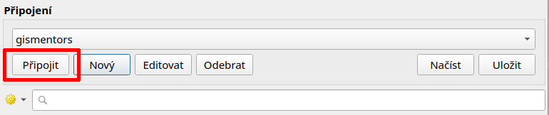
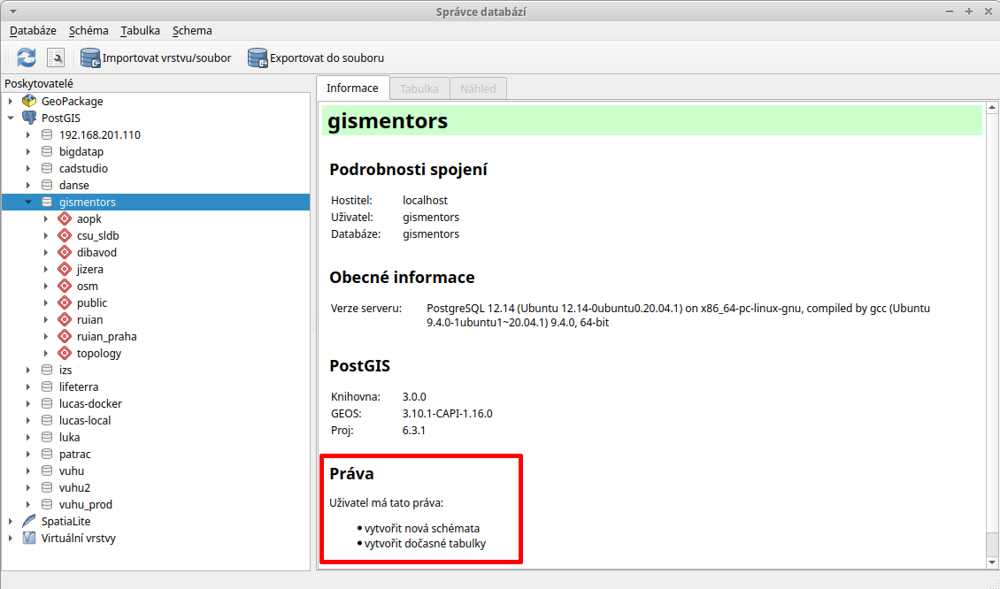
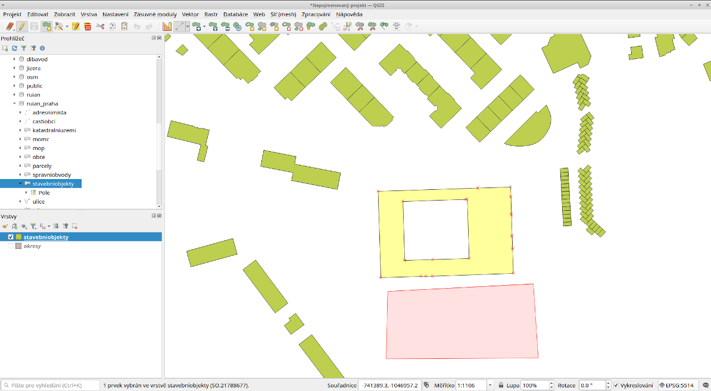
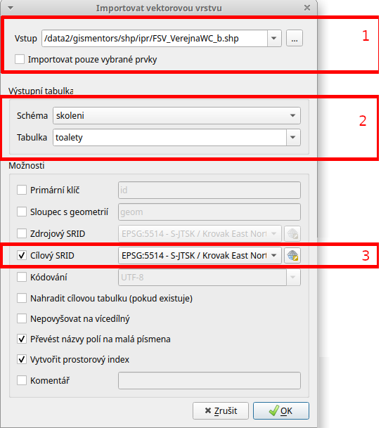

Začínáme
========

Na úvod si ukážeme přístup k datům uložených v databázi z prostředí
:program:`QGIS`.

Zobrazujeme data v QGIS
-----------------------

.. _qgis-add-pg-layer:

Vektorová data uložená v geodatabázi PostGIS je možné načíst buď z *menu*

.. figure:: ../images/qgis-add-pg-vector-menu.png

anebo z *nástrojové lišty* aplikace QGIS. Další možností je použít
:ref:`datový katalog <DataCatalog>`.

.. figure:: ../images/qgis-add-pg-vector-toolbar.png
	    :width: 150px

V dialogu nejprve nadefinujeme parametry připojení k databázi.

.. figure:: ../images/qgis-postgis-new.png

Nastavíme:

* název spojení :fignote:`(1)`
* hostitel (adresa serveru, pokud je to localhost, nemusíme vyplňovat) :fignote:`(2)`
* databáze, ke které se chceme připojit :fignote:`(3)`
* uživatelské jméno a heslo pro připojení k databázi :fignote:`(4)`

.. figure:: ../images/qgis-postgis-new-settings.png
           :width: 350px

Pro opětovné připojení je vhodné si uživatelské jméno a popřípadě i
heslo (v tomto případě bude heslo uloženo na lokálním disku v textovém
souboru!) uložit :fignote:`(5)`

.. figure:: ../images/qgis-pg-conn-warning.png
	    :class: small

Nastavení připojení k databázi nejprve otestujeme :fignote:`(6)` a
poté potvrdíme.

.. figure:: ../images/qgis-pg-conn-test.png
            :class: small

Následně se již můžeme k databázi připojit

a vybrat vektorové vrstvy :fignote:`(1)`, které chceme z geodatabáze
načíst :fignote:`(2)`.

.. figure:: ../images/qgis-postgis-layers.png
           :width: 700px

.. _DataCatalog:

Alternativní postup (datový katalog)
^^^^^^^^^^^^^^^^^^^^^^^^^^^^^^^^^^^^

Připojení k databázi PostGIS je možné definovat i v rámci *datového
katalogu (prohlížeče)*.

.. figure:: ../images/../images/qgis-catalog-new.png
            :width: 300px

.. figure:: ../images/../images/qgis-postgis-new-settings.png
           :width: 350px

Vektorovou vrstvu z geodatabáze PostGIS přetáhneme z datového katalogu
do okna *Vrstvy*.

.. figure:: ../images/../images/qgis-catalog-layer.png
	    :class: small

Připojujeme se do databáze z QGIS
---------------------------------

Přístup do databáze umožnuje zásuvný modul QGISu :program:`DB
Manager` (Správce databází).

.. note:: Tento zásuvný modul je součástí základní instalace a je
	  dostupný automaticky.

.. _db-manager:

DB Manager spustíme z menu aplikace QGIS.

.. figure:: ../images/qgis-db-manager-menu.png
            :width: 350px

V dialogu vybereme testovací databázi *gismentors*.

            Uživatel ``skoleni`` má právo v databázi vytvářet vlastní schémata.

Můžeme procházet metadata jednotlivých vrstev uložených v geodatabázi.

.. figure:: ../images/qgis-db-manager-layer.png
            :width: 700px

            Uživatel ``skoleni`` má pro vrstvu :map:`obce_polygon` ve
            schématu *ruian* veškerá práva a data může případně
            modifikovat.

Provádíme SQL dotazy
^^^^^^^^^^^^^^^^^^^^

Otevřeme dialog pro :doc:`SQL dotazy <2_jazyk_sql>`.

.. figure:: ../images/qgis-db-manager-sql-toolbar.png
   :width: 200px

Tento dialog umožnuje provádět jednoduché SQL dotazy.

.. figure:: ../images/qgis-db-manager-sql-window.png
   :class: middle
   
   Příklad určení počtu obcí v ČR

.. tip:: Pokročilejší uživatele ocení spíše konzolový nástroj
         :program:`psql`. Více k tomuto tématu ve školení `PostGIS pro
         pokročilé
         <http://www.gismentors.cz/skoleni/postgis/#pokrocily>`_.

Příklady dotazů
^^^^^^^^^^^^^^^

.. todo::

Editace vektorových dat
-----------------------

:program:`QGIS` umožňuje editaci různých formátů vektorových dat
včetně dat uložených v geodatabázi PostGIS. Přepnout danou vektorovou
vrstvu do *editačního módu* je možné z kontextového menu

.. figure:: ../images/qgis-edit-menu.png
            :width: 350px

anebo *nástrojové lišty* QGISu.

.. figure:: ../images/qgis-edit-toolbar.png
            :width: 300px

Po přepnutí do editačního módu se vektorová vrstva zobrazí včetně
lomových bodů (červené křížky).

.. figure:: ../images/qgis-edit-mode.png
            :width: 800px

**Editační nástrojová lišta** QGISu umožňuje

.. figure:: ../images/qgis-edit-toolbar.png
            :width: 350px

.. table::
   :class: toc

   +-----+-------------------------------------------------+
   | |A| |  přidávat nové prvky                            |
   +-----+-------------------------------------------------+
   | |M| |  přesunovat existující prvky                    |
   +-----+-------------------------------------------------+
   | |N| |  modifikovat uzly (přidávat, mazat a přesunovat)|
   +-----+-------------------------------------------------+
   | |D| |  smazat vybrané prvky                           |
   +-----+-------------------------------------------------+
   | |C| |  vyjmout vybrané prvky                          |
   +-----+-------------------------------------------------+
   | |O| |  kopírovat vybrané prvky                        |
   +-----+-------------------------------------------------+
   | |P| |  vložit prvky                                   |
   +-----+-------------------------------------------------+

.. |A| image:: ../images/qgis-edit-add.png
               :width: 32px
               :align: middle

.. |M| image:: ../images/qgis-edit-move.png
               :width: 32px
               :align: middle

.. |N| image:: ../images/qgis-edit-node.png
               :width: 32px
               :align: middle

.. |D| image:: ../images/qgis-edit-delete.png
               :width: 32px
               :align: middle

.. |C| image:: ../images/qgis-edit-cut.png
               :width: 32px
               :align: middle

.. |O| image:: ../images/qgis-edit-copy.png
               :width: 32px
               :align: middle

.. |P| image:: ../images/qgis-edit-paste.png
               :width: 32px
               :align: middle

Příklad přidání nového prvku
^^^^^^^^^^^^^^^^^^^^^^^^^^^^

Z nástrojové lišty vybereme nástroj pro *přidávání nového prvku*.

Lomové body nového prvku volíme stisknutím levého tlačítka
myši. Poslední uložený lomový bod můžeme vrátit zpět pomocí klávesy
:kbd:`Backspace`.

Editaci prvku ukončíme stisknutím pravého tlačítka myši. V posledním
kroku můžeme vyplnit atributy nově přidaného prvku.

.. figure:: ../images/qgis-edit-new-feature-attr.png
            :width: 800px

.. note:: Více k editace v `manuálu
          <http://docs.qgis.org/2.2/en/docs/user_manual/working_with_vector/editing_geometry_attributes.html>`_
          QGISu.

Nahráváme vlastní data do databáze
----------------------------------

Import dat ve formátu Esri Shapefile
^^^^^^^^^^^^^^^^^^^^^^^^^^^^^^^^^^^^

Předpokládáme, že každý uživatel pracuje ve vlastní databázovém
schématu. Toto schéma vytvoříme pomocí zásuvného modulu :ref:`DB
Manageru <db-manager>`.

Vytvoření databázového schématu
~~~~~~~~~~~~~~~~~~~~~~~~~~~~~~~

V našem případě uložíme vektorová data do *vlastního schématu*,
nejprve toto schéma vytvoříme.

.. figure:: ../images/qgis-db-manager-new-schema.png
            :width: 300px

.. figure:: ../images/qgis-db-manager-create-schema.png
            :width: 225px

.. figure:: ../images/qgis-db-manager-new-schema-prop.png
            :width: 700px

            V nově vytvořeném schématu již má uživatel ``landa``
            právo zápisu.

Import dat
~~~~~~~~~~

Import vektorových dat ve formátu Esri Shapefile umožňuje zásuvný
modul *Spit (Shapefile import)* dostupný z menu aplikace QGIS.

.. figure:: ../images/qgis-spit-menu.png
            :width: 350px

.. note:: Pokud není nástroj dostupný je nutné ho aktivovat z menu
          :menuselection:`Zásuvné moduly --> Spravovat a instalovat
          zásuvné moduly`.

	  .. figure:: ../images/qgis-spit-plugin.png

.. note:: Použijeme otevřená data poskytovaná IPR, konkrétně
          `občanskou vybavenost - toalety
          <http://opendata.iprpraha.cz/CUR/FSV/FSV_VerejnaWC_b/S_JTSK/FSV_VerejnaWC_b_shp.zip>`_.

V dialogu zvolíme databázi :fignote:`(1)`, ke které se
připojíme :fignote:`(2)`. Přidáme soubor ve formátu Esri Shapefile
:fignote:`(3)` určený k importu, definujeme název pro výstupní
databázovou tabulku a schéma :fignote:`(4)`. Jako poslední určíme kód
souřadnicového systému (v tomto případě S-JTSK, tj. :epsg:`5514`)
vektorových dat :fignote:`(5)`.

.. figure:: ../images/qgis-spit-dialog.png
            :class: middle

.. figure:: ../images/qgis-spit-progress.png
	    :width: 200px

Naimportovaná vrstva z geodatabáze PostGIS se nezobrazí automaticky,
musíme ji :ref:`přidat manuálně <qgis-add-pg-layer>`.

.. figure:: ../images/qgis-add-pg-so.png
            :class: large

Další možnosti
^^^^^^^^^^^^^^

DB Manager
~~~~~~~~~~

Nahrání dat ve formátu Esri Shapefile do geodatabáze PostGIS umožňuje
v QGISu i zásuvný modul :program:`DB Manager`. Soubor ve formátu Esri
Shapefile naimportujeme z menu

.. figure:: ../images/shp-import-menu.png
           :width: 200px

anebo z nástrojové lišty DB Manageru.

.. figure:: ../images/shp-import.png
           :width: 250px

V dialogu vybereme soubor pro import do geodatabáze
:fignote:`(1)`. Dále můžeme změnit cílové schéma a název výsledné
tabulky v databázi :fignote:`(2)`. Dialog nabízí další možnosti včetně
transformace do jiného souřadnicového systému :fignote:`(3)`.

	    
.. figure:: ../images/qgis-db-manager-finish.png
            :width: 200px

pgAdmin
~~~~~~~

Vektorová data ve formátu Esri Shapefile lze do databáze PostGIS
naimportovat pomocí zásuvného modulu :program:`PostGIS Shapefile and DBF loader`
aplikace `pgAdmin <http://www.pgadmin.org/>`_.

.. figure:: ../images/pgadmin-import.png
            :width: 350px

Nejprve definujeme soubor ve formátu Esri Shapefile :fignote:`(1)`,
cílové databázové schéma a cílovou tabulku :fignote:`(2)` a případně i
souřadnicový systém :fignote:`(3)`.

.. figure:: ../images/pgadmin-create.png

.. figure:: ../images/pgadmin-new-layer.png
            :class: large

Pro pokročilé uživatele
^^^^^^^^^^^^^^^^^^^^^^^

.. tip:: Více k tomuto tématu ve školení `PostGIS pro pokročilé
         <http://www.gismentors.cz/skoleni/postgis/#pokrocily>`_.

shp2pgsql
~~~~~~~~~

`shp2pgsql
<http://postgis.net/docs/using_postgis_dbmanagement.html#shp2pgsql_usage>`_
je konzolový nástroj, který umožňuje import vektorových dat ve formátu
Esri Shapefile do geodatabáze PostGIS. Tento nástroj je součástí
instalace PostGIS.

Nejprve vytvoříme SQL dávku

.. code-block:: bash

               shp2pgsql -s 5514 FSV_VerejnaWC_b.shp landa.toalety > wc.sql

* ``-s`` definuje souřadnicový systém,
* ``FSV_VerejnaWC_b.shp`` je název vstupního souboru ve formátu Esri Shapefile,
* ``landa.toalety`` je název výstupního databázového schématu a tabulky,
* ``> wc.sql`` dávka je uložena do souboru ``wc.sql``.

Vytvořenou SQL dávku nahrajeme do databáze *gismentors*:

.. code-block:: bash

                psql gismentors -U skoleni -W -h training.gismentors.eu -f wc.sql

ogr2ogr
~~~~~~~

`ogr2ogr <http://www.gdal.org/ogr2ogr.html>`_ je konzolový nástroj
knihovny `GDAL <http://gdal.org>`_ umožňující konverzi mezi datovými
formáty podporovanými touto knihovnou.

.. code-block:: bash

   ogr2ogr -f PostgreSQL \
   PG:"dbname=gismentors host=training.gismentors.eu user=skoleni password=XXX active_schema=landa" \
   FSV_VerejnaWC_b.shp \
   -a_srs EPSG:5514
