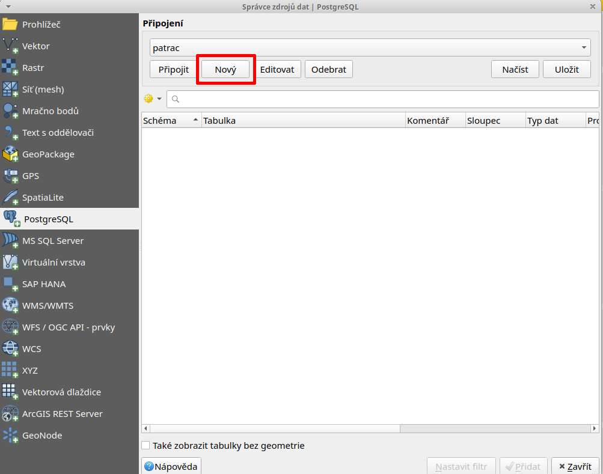
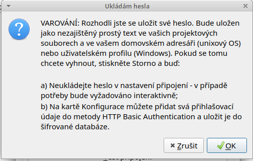
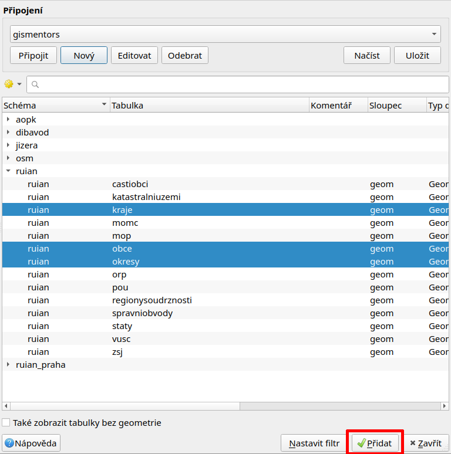

Začínáme
========

Na úvod si ukážeme přístup k datům uložených v databázi z prostředí
:program:`QGIS`.

Zobrazujeme data v QGIS
-----------------------

Vektorová data uložená v geodatabázi PostGIS je možné načíst buď z *menu*

.. figure:: ../images/qgis-add-pg-vector-menu.png

anebo z *nástrojové lišty* aplikace QGIS. Další možností je použít
:ref:`datový katalog <DataCatalog>`.

.. figure:: ../images/qgis-add-pg-vector-toolbar.png
	    :width: 150px

V dialogu nejprve nadefinujeme parametry připojení k databázi.

Nastavíme:

* název spojení :fignote:`(1)`
* hostitel (adresa serveru, pokud je to localhost, nemusíme vyplňovat) :fignote:`(2)`
* databáze, ke které se chceme připojit :fignote:`(3)`
* uživatelské jméno a heslo pro připojení k databázi :fignote:`(4)`

.. figure:: ../images/qgis-postgis-new-settings.png
           :width: 350px

Pro opětovné připojení je vhodné si uživatelské jméno a popřípadě i
heslo (v tomto případě bude heslo uloženo na lokálním disku v textovém
souboru!) uložit :fignote:`(5)`

Nastavení připojení k databázi nejprve otestujeme :fignote:`(6)` a
poté potvrdíme.

.. figure:: ../images/qgis-pg-conn-test.png
            :class: small

Následně se již můžeme k databázi připojit

.. figure:: ../images/qgis-postgis-connect.png
           :width: 600px

a vybrat vektorové vrstvy :fignote:`(1)`, které chceme z geodatabáze
načíst :fignote:`(2)`.

.. _DataCatalog:

Alternativní postup (datový katalog)
^^^^^^^^^^^^^^^^^^^^^^^^^^^^^^^^^^^^

Připojení k databázi PostGIS je možné definovat i v rámci *datového
katalogu (prohlížeče)*.

.. figure:: ../images/qgis-catalog-new.png
            :width: 300px

.. figure:: ../images/qgis-postgis-new-settings.png
           :width: 350px

Vektorovou vrstvu z geodatabáze PostGIS přetáhneme z datového katalogu
do okna *Vrstvy*.

.. figure:: ../images/qgis-catalog-layer.png
	    :class: small

Připojujeme se do databáze z QGIS
---------------------------------

Otevíráme tabulku
-----------------
