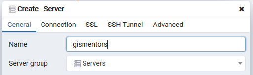

.. |sqlwindow| image:: ../images/qgis-db-manager-sql-toolbar.png
   :width: 24px
.. |pgSQLWindow| image:: ../images/pgadmin-sql-window-toolbar.png
   :width: 24px

=================
Prostorové dotazy
=================

Připojujeme se do databáze z QGIS
---------------------------------

.. index::
   single: správce databází
   single: QGIS
   single: schéma

Přístup do databáze umožnuje zásuvný modul QGISu :program:`DB
Manager` (Správce databází).

.. _db-manager:

DB Manager spustíme z menu aplikace QGIS :menuselection:`Databáze -->
Správce databází --> Správce databází`.

V dialogu vybereme databázi školení "gismentors".

.. figure:: ../images/qgis-db-manager-priv.png
   :class: middle
	   
   Uživatel má v tomto případě právo v databázi vytvářet
   vlastní schémata a dočasné tabulky.

Můžeme procházet metadata jednotlivých vrstev uložených v geodatabázi.

	      
   Uživatel má v tomto případě pro vrstvu `obce` ve schématu *ruian*
   veškerá práva a může ji modifikovat.

Provádíme SQL dotazy
^^^^^^^^^^^^^^^^^^^^

.. index::
   single: SQL

Otevřeme dialog SQL okna |sqlwindow|, které nám umožní provádět
jednoduché :doc:`SQL dotazy <3_jazyk_sql>` přímo v prostředí aplikace
QGIS.

.. figure:: ../images/qgis-db-manager-sql-window.png
   :class: middle
   :scale-latex: 75
              
   Příklad určení počtu obcí v ČR.

.. tip:: Pokročilejší uživatelé ocení spíše konzolový nástroj
         :program:`psql`. Více k tomuto tématu ve školení
         :skoleni:`PostGIS pro pokročilé <postgis-pokrocily>`.

.. index::
   single: mapová vrstva
   single: QGIS

Vytváříme novou vrstvu jako výsledek prostorového dotazu
~~~~~~~~~~~~~~~~~~~~~~~~~~~~~~~~~~~~~~~~~~~~~~~~~~~~~~~~

Na základě prostorového dotazu můžeme pomocí dialogu *správce
databází* vytvářet nové datové vrstvy.

V nasledujícím příkladě vybereme :fignote:`(1)` obce
(:dbtable:`ruian.obce_polygon`), které obsahují alespoň jednu pořární
stanici (:dbtable:`osm.pozarni_stanice`). Výsledek zobrazíme v QGISu
jako novou vrstvu :map:`obce_pozarni_stanice` :fignote:`(2)`.

.. note:: 

   .. code-block:: sql
                   
      SELECT o.* FROM ruian.obce AS o JOIN osm.pozarni_stanice AS p
       ON ST_Within(p.geom, o.geom);

   Dotaz vracím obce, ve kterých je více než jedna požární stanice,
   jako duplicitní. Správně by tento dotaz mohl vypadat
   např. následovně:

   .. code-block:: sql

      SELECT o.* FROM ruian.obce AS o WHERE EXISTS
      (
       SELECT 1 FROM osm.pozarni_stanice AS p WHERE ST_Within(p.geom, o.geom)
      );

.. figure:: ../images/qgis-query-new-layer.png
   :class: middle
   :scale-latex: 83
	      
.. note:: Alternativně můžete novou vrsvu vytvořit v databázi rovnou
          jako novou tabulku anebo pohled a zobrazit v QGISu standardní cestou.

          .. code-block:: sql

             -- nejprve vytvoříme vlastní schéma
             CREATE SCHEMA uzivatel;
             
             CREATE VIEW uzivatel.obce_pozarni_stanice AS
             SELECT o.* FROM ruian.obce_polygon AS o WHERE EXISTS
             (
              SELECT 1 FROM osm.pozarni_stanice AS p WHERE ST_Within(p.geom, o.geom)
             );
          
.. figure:: ../images/qgis-query-new-layer-disp.png
   :class: large
   :scale-latex: 70
              
   Výsledek prostorového dotazu.

.. index::
   single: pgadmin

.. _pgadmin3:
   
Přístup z PgAdmin
-----------------

SQL dotazy můžeme provádět v grafické uživatelském prostředí `PgAdmin
<http://www.pgadmin.org/>`__. V následujícím textu předpokládáme verzi
PgAdmin 4.

.. note::

   Pokud používáte QGIS, tak Vám PgAdmin nepřinese nic nového, spíše
   naopak. PgAdmin není GIS aplikace (od verze 3.3 PgAdmin4 nabízí
   alespoň `jednoduchou problížečku geografických dat
   <https://www.bostongis.com/blog/index.php?/archives/272-pgAdmin4-now-offers-PostGIS-geometry-viewer.html>`__). Neumožní
   Vám zobrazit výsledky prostorových dotazů v mapovém okně podobně
   jako QGIS. Jde o grafické uživatelské rozhraní pro přístup k
   databázi PostgreSQL, nic víc. Navíc nepodporuje našeptávání a další
   užitečné funkce. Pro efektivní práci s databází se nejvíce hodí
   konzolový klient :program:`psql`, více na školení :skoleni:`PostGIS
   pro pokročilé <postgis-pokrocily>`.

           
   Přidáme nové spojení.

.. figure:: ../images/pgadmin-new-conn-dialog-1.png
   :width: 400px
   :scale-latex: 35
                 
   V následujícím dialogu zadáme název připojení a především parametry
   připojení k databázi.
                 
Do seznamu se přidá nová položka.

Z menu :menuselection:`Tools --> Query Tool` otevřeme nástroj, který
nám umožní provádět SQL dotazy.

.. figure:: ../images/pgadmin-sql-window.png
   :class: large

   Příklad určení počtu obcí v ČR.

Přístup z DbEaver
-----------------

SQL dotazy můžeme provádět v grafické uživatelském prostředí `DbEaver
<https://dbeaver.io/>`__.

Tento nástroj nabízí přístup nejen k PostgreSQL, ale i jiným typům databází.

Také má integrovaný prohlížeč geodat, včetně zobrazení podkladu v podobě OSM
nebo jiných služeb.

.. figure:: ../images/dbeaver-new-connection.png
   :width: 400px
   :scale-latex: 35

.. figure:: ../images/dbeaver.png
   :class: large
