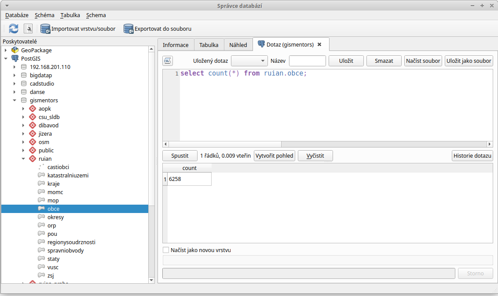
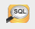

=================
Prostorové dotazy
=================

Připojujeme se do databáze z QGIS
---------------------------------

Přístup do databáze umožnuje zásuvný modul QGISu :program:`DB
Manager` (Správce databází).

.. note:: Tento zásuvný modul je součástí základní instalace a je
	  dostupný automaticky.

.. _db-manager:

DB Manager spustíme z menu aplikace QGIS.

.. figure:: ../images/qgis-db-manager-menu.png
            :width: 350px

V dialogu vybereme testovací databázi *gismentors*.

.. figure:: ../images/qgis-db-manager-priv.png
            :width: 700px

            Uživatel ``skoleni`` má právo v databázi vytvářet vlastní schémata.

Můžeme procházet metadata jednotlivých vrstev uložených v geodatabázi.

.. figure:: ../images/qgis-db-manager-layer.png
            :width: 700px

            Uživatel ``skoleni`` má pro vrstvu :map:`obce_polygon` ve
            schématu *ruian* veškerá práva a data může případně
            modifikovat.

Provádíme SQL dotazy
--------------------

Otevřeme dialog pro :doc:`SQL dotazy <2_jazyk_sql>`.

.. figure:: ../images/qgis-db-manager-sql-toolbar.png
   :width: 200px

Tento dialog umožnuje provádět jednoduché SQL dotazy.

   
   Příklad určení počtu obcí v ČR

.. tip:: Pokročilejší uživatele ocení spíše konzolový nástroj
         :program:`psql`. Více k tomuto tématu ve školení `PostGIS pro
         pokročilé
         <http://www.gismentors.cz/skoleni/postgis/#pokrocily>`_.

Vytváříme novou vrstvu jako výsledek prostorového dotazu
^^^^^^^^^^^^^^^^^^^^^^^^^^^^^^^^^^^^^^^^^^^^^^^^^^^^^^^^

Alternativní přístup z PgAdmin
------------------------------

Přidáme nové spojení.

.. figure:: ../images/pgadmin-new-conn-toolbar.png
   :class: small
	    
V následujícím dialogu vyplníme parametry připojení k databázi (viz
:ref:`db-connection`).

.. figure:: ../images/pgadmin-new-conn-dialog.png
   :width: 400px

Připojení se přidá do seznamu.

.. figure:: ../images/pgadmin-new-conn.png
   :class: small

Otevřeme SQL okno, do kterého budeme moci posléze psát SQL dotazy.

.. figure:: ../images/pgadmin-sql-window.png
   :class: middle

   Příklad určení počtu obcí v ČR

Příklady dotazů
---------------

.. todo:: select DISTINCT * from ruian.obce_polygon as o join osm.zeleznice as z on st_intersects(z.geom, o.geom)
