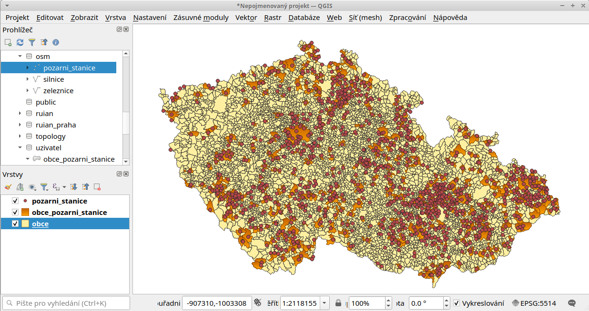
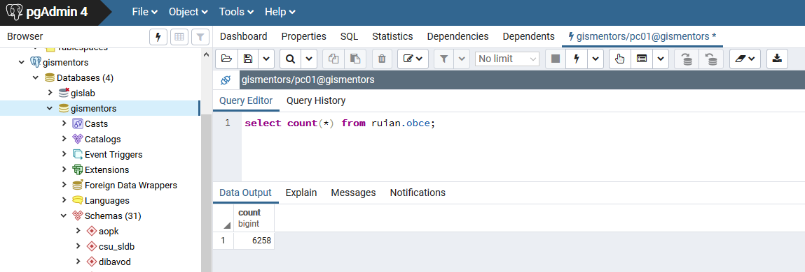

.. |sqlwindow| image:: ../images/qgis-db-manager-sql-toolbar.png
   :width: 24px
.. |pgNewConnection| image:: ../images/pgadmin-new-conn-toolbar.png
   :width: 24px
.. |pgSQLWindow| image:: ../images/pgadmin-sql-window-toolbar.png
   :width: 24px

=================
Prostorové dotazy
=================

Připojujeme se do databáze z QGIS
---------------------------------

Přístup do databáze umožnuje zásuvný modul QGISu :program:`DB
Manager` (Správce databází).

.. _db-manager:

DB Manager spustíme z menu aplikace QGIS :menuselection:`Databáze -->
Správce databází --> Správce databází`.

V dialogu vybereme databázi školení "gismentors".

.. figure:: ../images/qgis-db-manager-priv.png
   :class: middle
	   
   Uživatel má v tomto případě právo v databázi vytvářet
   vlastní schémata a dočasné tabulky.

Můžeme procházet metadata jednotlivých vrstev uložených v geodatabázi.

.. figure:: ../images/qgis-db-manager-layer.png
   :class: middle

   Uživatel má v tomto případě pro vrstvu `obce` ve schématu *ruian*
   veškerá práva a může ji modifikovat.

Provádíme SQL dotazy
--------------------

Otevřeme dialog SQL okna |sqlwindow|, které nám umožní provádět
jednoduché :doc:`SQL dotazy <3_jazyk_sql>` přímo v prostředí aplikace
QGIS.

.. figure:: ../images/qgis-db-manager-sql-window.png
   :class: middle
   :scale-latex: 60
              
   Příklad určení počtu obcí v ČR.

.. tip:: Pokročilejší uživatele ocení spíše konzolový nástroj
         :program:`psql`. Více k tomuto tématu ve školení
         :skoleni:`PostGIS pro pokročilé <postgis-pokrocily>`.

Vytváříme novou vrstvu jako výsledek prostorového dotazu
^^^^^^^^^^^^^^^^^^^^^^^^^^^^^^^^^^^^^^^^^^^^^^^^^^^^^^^^

Na základě prostorového dotazu můžeme pomocí dialogu *správce
databází* vytvářet nové datové vrstvy.

V nasledujícím příkladě vybereme :fignote:`(1)` obce
(:dbtable:`ruian.obce_polygon`), které obsahují alespoň jednu pořární
stanici (:dbtable:`osm.pozarni_stanice`). Výsledek zobrazíme v QGISu
jako novou vrstvu :map:`obce_pozarni_stanice` :fignote:`(2)`.

.. note:: 

   .. code-block:: sql
                   
      SELECT o.* FROM ruian.obce_polygon AS o JOIN osm.pozarni_stanice AS p
       ON ST_Within(p.geom, o.geom);

   Dotaz vracím obce, ve kterých je více než jedna požární stanice,
   jako duplicitní. Správně by tento dotaz mohl vypadat
   např. následovně:

   .. code-block:: sql

      SELECT o.* FROM ruian.obce_polygon AS o WHERE EXISTS
      (
       SELECT 1 FROM osm.pozarni_stanice AS p WHERE ST_Within(p.geom, o.geom)
      );

.. figure:: ../images/qgis-query-new-layer.png
   :class: middle
	   
.. note:: Alternativně můžete novou vrsvu vytvořit v databázi rovnou
          jako novou tabulku anebo pohled a zobrazit v QGISu standardní cestou.

          .. code-block:: sql

             -- nejprve vytvoříme vlastní schéma
             CREATE SCHEMA uzivatel;
             
             CREATE VIEW uzivatel.obce_pozarni_stanice AS
             SELECT o.* FROM ruian.obce_polygon AS o WHERE EXISTS
             (
              SELECT 1 FROM osm.pozarni_stanice AS p WHERE ST_Within(p.geom, o.geom)
             );
          

              
   Výsledek prostorového dotazu.

.. _pgadmin3:
   
Přístup z PgAdmin
-----------------

SQL dotazy můžeme provádět v grafické uživatelském prostředí `PgAdmin
<http://www.pgadmin.org/>`_.

.. note::

   Pokud používáte QGIS, tak Vám PgAdmin nepřinese nic nového, spíše
   naopak. PgAdmin není GIS aplikace. Neumožní Vám zobrazit výsledky
   prostorových dotazů v mapovém okně podobně jako QGIS. Jde o
   grafické uživatelské rozhraní pro přístup k databázi PostgreSQL,
   nic víc. Navíc nepodporuje našeptávání a další užitečné funkce. Pro
   efektivní práci s databází se nejvíce hodí konzolový klient
   :program:`psql`, více na školení :skoleni:`PostGIS pro pokročilé
   <postgis-pokrocily>`.

Přidáme nové spojení |pgNewConnection|.

V následujícím dialogu vyplníme parametry připojení k databázi.

.. figure:: ../images/pgadmin-new-conn-dialog.png
   :width: 400px
   :scale-latex: 40

.. raw:: latex

   \newpage
                          
Připojení se přidá do seznamu.

.. figure:: ../images/pgadmin-new-conn.png
   :class: middle

Otevřeme SQL dialog, který nám umožní provádět SQL dotazy |pgSQLWindow|.

   Příklad určení počtu obcí v ČR.
