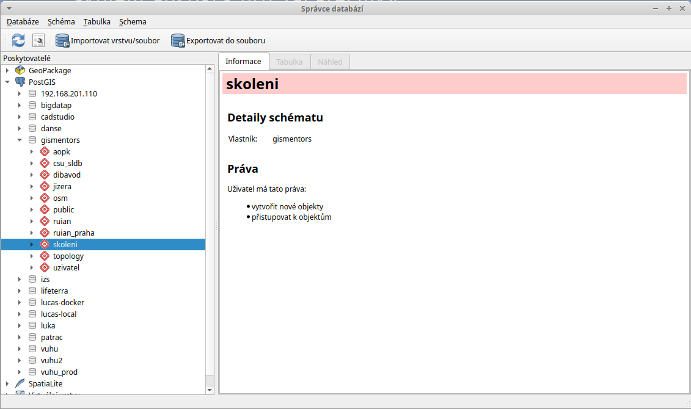
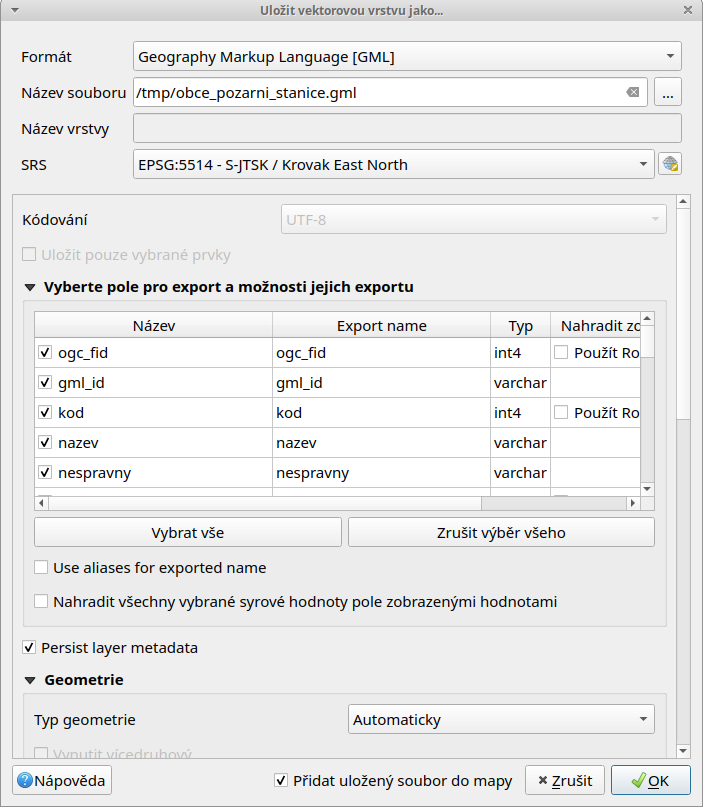

==============================
Import a export dat z databáze
==============================

Nahráváme vlastní data do databáze
----------------------------------

Správce databází
^^^^^^^^^^^^^^^^

Předpokládáme, že každý uživatel pracuje ve vlastní databázovém
schématu. Toto schéma vytvoříme pomocí :ref:`správce databází
<db-manager>` v QGISu.

Vytvoření databázového schématu
~~~~~~~~~~~~~~~~~~~~~~~~~~~~~~~

V našem případě uložíme vektorová data do *vlastního schématu*,
nejprve toto schéma vytvoříme :menuselection:`Schéma --> Vytvořit
schéma`.

            V nově vytvořeném schématu již má uživatel "skoleni" právo
            zápisu.

Import dat
~~~~~~~~~~

Nahrání geodat do databáze PostGIS umožňuje v QGISu samotný *správce
databází*. Soubor s geodaty anebo načtenou vrstvu v QGISu
naimportujeme z menu :menuselection:`Tabulka --> Importovat
vrstvu/soubor` anebo z nástrojové lišty správce databází |dbManagerImport|.

V dialogu vybereme soubor pro import do geodatabáze
:fignote:`(1)`. Dále můžeme změnit cílové schéma a název výsledné
tabulky v databázi :fignote:`(2)`. Dialog nabízí další možnosti včetně
transformace do jiného souřadnicového systému (pokud je zadán současně
zdrojový a cílový souřadnicivový systém) anebo prosté vynucení
cílového souřadnicového systému :fignote:`(3)`.

.. figure:: ../images/qgis-db-manager-create-table.png
	    :width: 400px
            :scale-latex: 50

.. note:: Ve níže uvedeném případě importujeme vrstvu veřejných toalet
          z `otevřené datové sady IPR
          <http://www.geoportalpraha.cz/cs/opendata/B5E575FB-AE56-4928-8C4F-AD0B97308093#.Vtwe5kKi7MU>`_.
	  
Naimportovaná vrstva z geodatabáze PostGIS se nezobrazí automaticky,
musíte ji do mapového okna :ref:`přidat manuálně <qgis-add-pg-layer>`.

Další možnosti
^^^^^^^^^^^^^^

Spit
~~~~

Import vektorových dat ve formátu *Esri Shapefile* umožňuje také
zásuvný modul *Spit (Shapefile import)* dostupný z menu aplikace QGIS
:menuselection:`Spit (Shapefile import) --> Import Shapefile do
PostgreSQL`.

.. warning:: Zásuvný modul Spit není od verze QGIS 2.14 podporován a
	     nijak udržován. Pro import dat se doporučuje používat
	     *správce databází*.

pgAdmin
~~~~~~~

Vektorová data ve formátu *Esri Shapefile* lze do databáze PostGIS
naimportovat pomocí zásuvného modulu *PostGIS Shapefile and DBF
loader* aplikace :ref:`PgAdmin <pgadmin3>` :menuselection:`Zásuvné
moduly --> PostGIS Shapefile and DBF loader`.

V dialogu pro import definujeme vstupní soubor ve formátu Esri
Shapefile :fignote:`(1)`, cílové databázové schéma a cílovou tabulku
:fignote:`(2)` a případně i souřadnicový systém :fignote:`(3)`.

.. figure:: ../images/pgadmin-create.png

Pro pokročilé uživatele
^^^^^^^^^^^^^^^^^^^^^^^

.. tip:: Více k tomuto tématu ve školení :skoleni:`PostGIS pro
         pokročilé
         <postgis-pokrocily/kapitoly/3_shp2pgsql_a_davkove_nahrani.html>`.

shp2pgsql
~~~~~~~~~

`shp2pgsql
<http://postgis.net/docs/using_postgis_dbmanagement.html#shp2pgsql_usage>`_
je konzolový nástroj, který umožňuje import vektorových dat ve formátu
*Esri Shapefile* do geodatabáze PostGIS. Tento nástroj je součástí
instalace PostGIS.

.. notecmd:: Import dat do databáze pomocí shp2pgsql

   Nejprve vytvoříme SQL dávku

   .. code-block:: bash

      shp2pgsql -s 5514 FSV_VerejnaWC_b.shp skoleni.toalety > wc.sql

   * ``-s`` definuje souřadnicový systém (v tomto případě :epsg:`5514`),
   * ``FSV_VerejnaWC_b.shp`` je název vstupního souboru ve formátu Esri Shapefile,
   * ``landa.toalety`` je název výstupního databázového schématu a tabulky (oddělené tečkou),
   * ``> wc.sql`` dávka je uložena do souboru ``wc.sql``.

   Vytvořenou SQL dávku nahrajeme do databáze *gismentors* přes
   nástroj :program:`psql` a jeho parametr :option:`-f`:

   .. code-block:: bash

      psql gismentors -U skoleni -W -h training.gismentors.eu -f wc.sql

.. _import-ogr2ogr:

ogr2ogr
~~~~~~~

`ogr2ogr <http://www.gdal.org/ogr2ogr.html>`_ je konzolový nástroj
knihovny `GDAL <http://gdal.org>`_ umožňující konverzi mezi datovými
formáty podporovanými touto knihovnou.

.. notecmd:: Import dat do databáze pomocí ogr2ogr

   .. code-block:: bash

      ogr2ogr -f PostgreSQL \
      PG:"dbname=gismentors host=training.gismentors.eu user=skoleni password=XXX \
      active_schema=skoleni" \
      FSV_VerejnaWC_b.shp \
      -a_srs EPSG:5514

.. raw:: latex

   \newpage

Export dat z databáze
---------------------

Data můžeme exportovat z databáze v prostředí QGIS naprosto stejně
jako u jiných formátů. Načteme si do QGIS vrstvu, kterou si přejeme
vyexportovat a z kontextového menu nad vrstvou zvolíme volbu
:item:`Save As`.

V následujícím dialogu zvolíme požadovaný výstupní formát a připadně
další volby, kterou jsou již závislé na zvoleném formátu.

   Příklad exportu vektorových dat z databáze do formátu OGC GML.

Pro pokročilé uživatele
^^^^^^^^^^^^^^^^^^^^^^^

Podobně jako v případě importu dat, lze použít pokročilejší konzolové
nástroje. Ty je možné volat ve skriptech při automatizaci
apod. Ukážeme si použití nástroje :program:`pgsql2shp`, který umožňuje
export dat do formátu Esri Shapefile a :program:`ogr2ogr` knihovny
GDAL.

.. tip:: Více k tomuto tématu ve školení :skoleni:`PostGIS pro
         pokročilé <postgis-pokrocily>`.

pgsql2shp
~~~~~~~~~

PostGIS kromě nástroje pro import dat ve formátu Esri Shapefile
:program:`shp2pgsql` nabízí obdobný nástroj pro export dat
:program:`pgsql2shp`. 

.. notecmd:: Export do formátu Esri Shapefile pomocí pgsql2shp

   V níže uvedeném příkladě vyexportujeme tabulku :dbtable:`obce` ze
   schéma *ruain* do souboru `obce.shp`.

   .. code-block:: sql
      
      pgsql2shp -h training.gismentors.eu -u skoleni -P XXX -f obce gismentors \
      ruian.obce

ogr2ogr
~~~~~~~

:program:`ogr2ogr` slouží obecně ke konverzi dat, lze jej tedy použít
jak pro import tak export dat.

.. notecmd:: Export do formátu Esri Shapefile pomocí ogr2ogr

   .. code-block:: bash

      ogr2ogr -f 'ESRI Shapefile' \
      -lco 'ENCODING=UTF-8' \
      obce.shp \
      PG:"dbname=gismentors host=training.gismentors.eu user=skoleni password=XXX" \
      ruian.obce

Na rozdíl od nástroje :program:`pgsql2shp` umožňuje :program:`ogr2ogr`
export nejen do formátu Esri Shapefile, ale do `celé řady formátů
<http://gdal.org/ogr_formats.html>`_, které knihovna GDAL porpodruje v
režimu zápisu.

.. notecmd:: Export do formátu GML pomocí ogr2ogr

   .. code-block:: bash

      ogr2ogr -f 'GML' \
      obce.gml \
      PG:"dbname=gismentors host=training.gismentors.eu user=skoleni password=XXX" \
      ruian.obce_polygon
