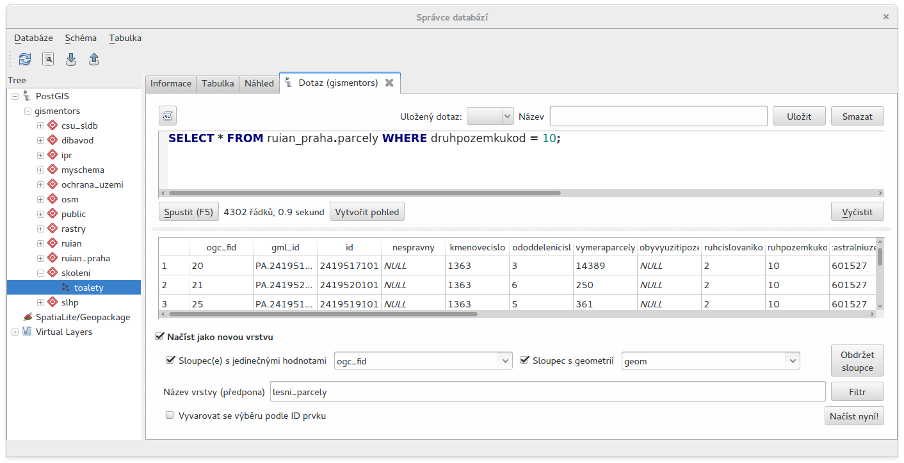
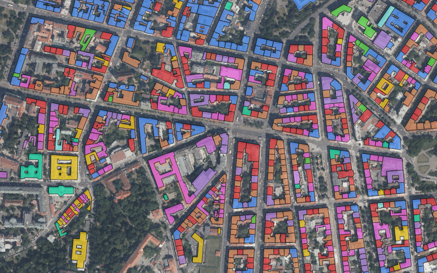
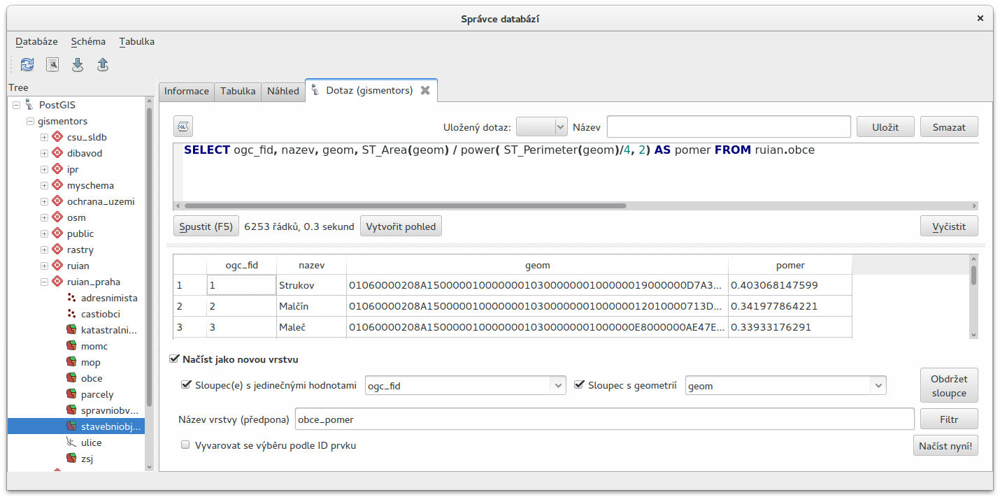
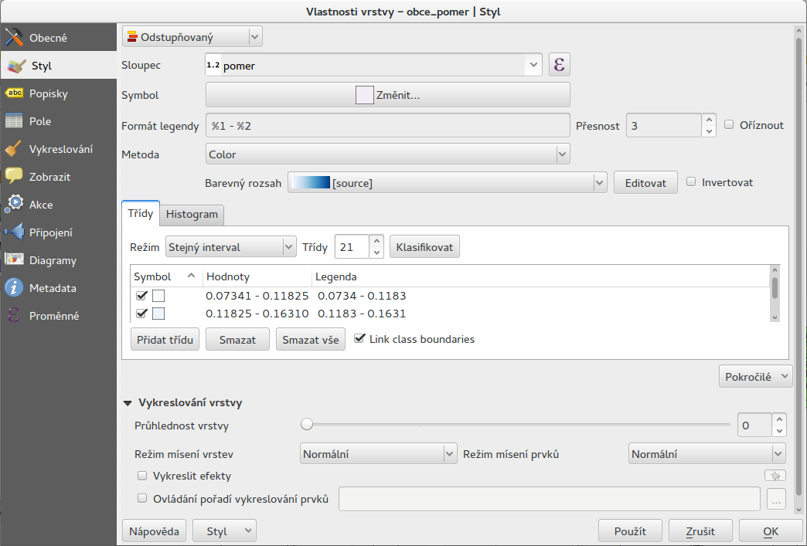
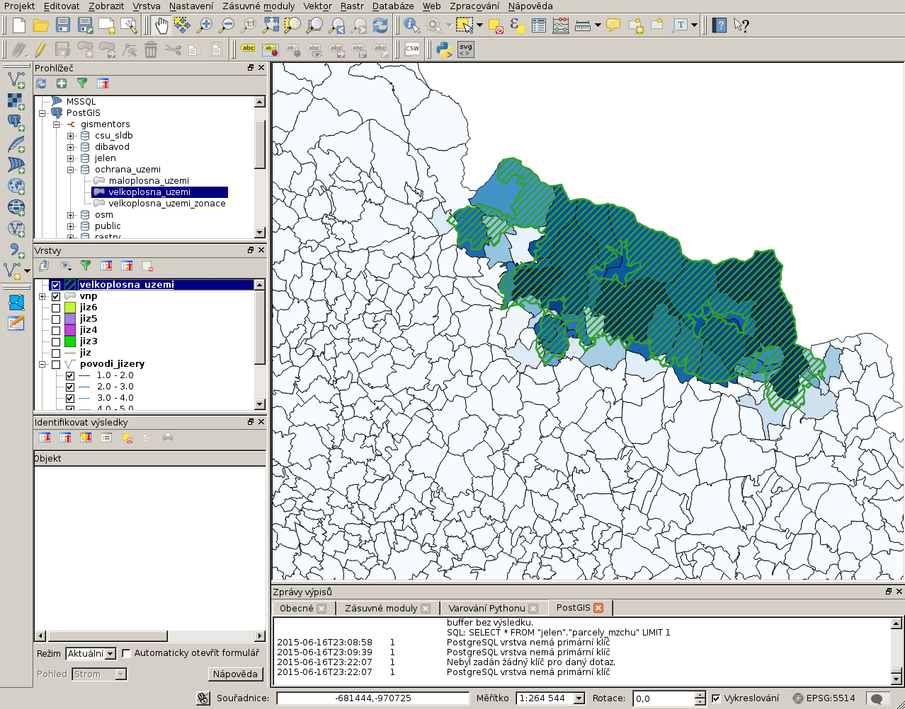

=================================================
Přehled vybraných prostorových funkcí a operátorů
=================================================

Operátory
---------

Mezi nejpoužívanější operátory patří:

* ``&&`` - překryv minimálních ohraničujících obdélníků

* ``<#>`` - vzdálenost minimálních ohraničujících obdélníků

* ``<->`` - vzdálenost centroidů

.. note::

     Více informací v :pgiscmd2:`dokumentaci PostGIS
     <reference.html#Operators>`.

Konstruktory
------------

Kostruktory jsou funkce vytvářející v PostGISu nové geometrické objekty.

:pgiscmd:`ST_GeomFromText` geometrie z WKT.

:pgiscmd:`ST_GeomFromGML`, :pgiscmd:`ST_GeomFromWKB`, :pgiscmd:`ST_Point`, ...

K vytvoření geometrie lze použít kromě funkcí PostGISu i přetypování z
:wikipedia-en:`WKT <Well-known text>`:

.. code-block:: sql

   SELECT
   'SRID=5514; POLYGON((0 0,0 1,1 1,1 0,0 0))'::geometry(POLYGON, 5514);

.. note::

     Více informací v :pgiscmd2:`dokumentaci PostGIS
     <reference.html#Geometry_Constructors>`.
         
Výstupy
-------

Funkce umožňující převod geometrie do jiné reprezentace.

:pgiscmd:`ST_AsText`, :pgiscmd:`ST_AsGML`, :pgiscmd:`ST_AsSVG`, ...

Rozměr geometrie
----------------

:pgiscmd:`ST_Area` plocha.

:pgiscmd:`ST_Perimeter` obvod.

:pgiscmd:`ST_Length` délka.

Další operace nad geometrií
---------------------------

:pgiscmd:`ST_ExteriorRing` obvodová hranice.

:pgiscmd:`ST_Dump` rozdělí multipart geometrii.

:pgiscmd:`ST_Polygonize` zaplochování.

:pgiscmd:`ST_ConvexHull` konvexní obal.

:pgiscmd:`ST_Translate` posun.

:pgiscmd:`ST_Buffer` obalová zóna.

:pgiscmd:`ST_SetSRID` nastaví SRID (ID souřadnicového systému)

...

Vzájemná poloha dvou geometrií
------------------------------

:pgiscmd:`ST_Relate` devítiprvková matice.

:pgiscmd:`ST_Intersects` existuje průnik (i jeden bod).

.. code-block:: sql

   SELECT 
   ST_Intersects(
      'POLYGON((0 0,0 1,1 1,1 0,0 0))'::geometry
      , ST_Translate('POLYGON((0 0,0 1,1 1,1 0,0 0))'::geometry,1,1)
   );

:pgiscmd:`ST_Disjoint`, :pgiscmd:`ST_Overlaps`, :pgiscmd:`ST_Crosses`, 
:pgiscmd:`ST_Within`, :pgiscmd:`ST_DWithin`, :pgiscmd:`ST_Touches`

Geometrické operace
-------------------

:pgiscmd:`ST_Intersection` průnik.

:pgiscmd:`ST_Difference` rozdíl.

:pgiscmd:`ST_SymDifference` symetrický rozdíl.

Agregace
--------

:pgiscmd:`ST_Union` sjednocení.

================
Praktické ukázky
================

Jak vypsat všechny tabulky s geometrií
--------------------------------------

Nejdříve si ukážeme, jak rychle zjistit, které tabulky v databázi
obsahují prostorová data.

Tuto informaci získáme z pohledu
:dbtable:`geometry_columns`. Ten zobrazuje data ze
systémových tabulek (data o typech a omezeních) a přehledně
je zobrazuje.

.. note:: Ve verzích PostGIS 1.x byl :dbtable:`geometry_columns`
          definován jako tabulka a nikoliv jako pohled.
          
Jeho struktura je následující:

.. table:: 
   :class: border
   
   +-------------------+------------------------+----------+
   |      Sloupec      |          Typ           | Uložení  |
   +===================+========================+==========+
   | f_table_catalog   | character varying(256) | extended |
   +-------------------+------------------------+----------+
   | f_table_schema    | character varying(256) | extended |
   +-------------------+------------------------+----------+
   | f_table_name      | character varying(256) | extended |
   +-------------------+------------------------+----------+
   | f_geometry_column | character varying(256) | extended |
   +-------------------+------------------------+----------+
   | coord_dimension   | integer                | plain    |
   +-------------------+------------------------+----------+
   | srid              | integer                | plain    |
   +-------------------+------------------------+----------+
   | type              | character varying(30)  | extended |
   +-------------------+------------------------+----------+

.. raw:: latex

   \vskip 1em

.. noteadvanced::

   PostGIS definuje pohled :dbtable:`geometry_columns` následovně:

   .. code-block:: sql

      SELECT current_database()::character varying(256) AS f_table_catalog,
       n.nspname::character varying(256) AS f_table_schema,
       c.relname::character varying(256) AS f_table_name,
       a.attname::character varying(256) AS f_geometry_column,
       COALESCE(NULLIF(postgis_typmod_dims(a.atttypmod), 2)
          , postgis_constraint_dims(n.nspname::text, c.relname::text, a.attname::text)
          , 2) AS coord_dimension,
       COALESCE(NULLIF(postgis_typmod_srid(a.atttypmod), 0)
          , postgis_constraint_srid(n.nspname::text, c.relname::text, a.attname::text)
          , 0) AS srid,
       replace(replace(COALESCE(NULLIF(upper(postgis_typmod_type(a.atttypmod)),
          'GEOMETRY'::text)
          , postgis_constraint_type(n.nspname::text, c.relname::text,
            a.attname::text)::text
          , 'GEOMETRY'::text), 'ZM'::text, ''::text), 'Z'::text,
            ''::text)::character varying(30) AS type
      FROM pg_class c,
       pg_attribute a,
       pg_type t,
       pg_namespace n
     WHERE t.typname = 'geometry'::name 
     AND a.attisdropped = false AND a.atttypid = t.oid AND
      a.attrelid = c.oid AND c.relnamespace = n.oid 
     AND (c.relkind = 'r'::"char" OR c.relkind = 'v'::"char" OR
      c.relkind = 'm'::"char" OR c.relkind = 'f'::"char") 
     AND NOT pg_is_other_temp_schema(c.relnamespace) 
     AND NOT (n.nspname = 'public'::name AND c.relname = 'raster_columns'::name) 
     AND has_table_privilege(c.oid, 'SELECT'::text);

Provedeme jednoduchý dotaz do tohoto pohledu.

.. code-block:: sql

   SELECT 
   * 
   FROM geometry_columns 
   WHERE f_table_schema = 'dibavod';

Vybíráme tedy všechny záznamy vztažené k tabulkám ze schématu
*dibavod*.

Výsledek může vypadat například takto:

::

   f_table_catalog   | gismentors
   f_table_schema    | dibavod
   f_table_name      | povodi_iii
   f_geometry_column | geom
   coord_dimension   | 2
   srid              | 5514
   type              | MULTIPOLYGON
   ...
   
Jednoduchý atributový dotaz
---------------------------

1) Vyberte parcely ze schématu *ruian_praha*:

   * s kódem ochrany `26` (pozemek určený k plnění funkcí lesa)

   * s druhem pozemku `10` (les)

.. note:: Nezapomeneme zkontrolovat, zda je sloupec, který
   dotazujeme, :ref:`oindexován <indexy>`.

.. code-block:: sql

   SELECT * FROM ruian_praha.parcely WHERE druhpozemkukod = 10;

	   
   Ukázka SQL dotazu ve správci databází, výsledek dotazu je zobrazen
   v QGISu jako nová mapová vrstva.

.. code-block:: sql

   SELECT * FROM ruian_praha.parcely WHERE druhpozemkukod = 26;

2) Vyberte stavební objekty ze schématu *ruian_praha* vybavené

   * plynem

   * výtahem a obarvěte je podle počtu podlaží

.. code-block:: sql
		   
   SELECT * FROM ruian_praha.stavebniobjekty
   WHERE pripojeniplynkod IS NOT NULL;
   
.. code-block:: sql

   SELECT * FROM ruian_praha.stavebniobjekty 
   WHERE vybavenivytahemkod IS NOT NULL;

	      
   Budovy v Praze s výtahem obarvené podle počtu podlaží.

Jednoduchý prostorový dotaz
---------------------------

1) Vypiště název obce a její rozlohu v hektarech

.. code-block:: sql

   SELECT 
   nazev
   , ST_Area(geom)/1e4 AS rozloha 
   FROM ruian.obce
   ORDER BY nazev; 

2) Zobrazte obce větší než 130 ha

.. code-block:: sql

   SELECT 
   *
   FROM ruian.obce
   WHERE ST_Area(geom)/1e4 > 130;

3) Nasymbolizujte vrstvu :dbtable:`ruian.obce` podle poměru rozlohy a
   čtvrtiny obvodu na druhou.

.. code-block:: sql

   SELECT ogc_fid
   , nazev
   , geom
   , ST_Area(geom) / power( ST_Perimeter(geom)/4, 2) AS pomer
   FROM ruian.obce;

	      
   Výsledek dotazu nahrajeme do QGISu jako novou mapovou vrstvu.

.. raw:: latex

   \newpage
   

	      
   Symbolizaci vrstvy provedeme v QGISu.

Atributový JOIN
---------------

1) Obarvěte obce (:dbtable:`ruian.obce`)

   * podle počtu obyvatel (:dbtable:`csu_sldb.sldb`)

   * počtu obyvatel na kilometr čtvereční

.. code-block:: sql

   SELECT
   ogc_fid, o.nazev, geom, vse1111/(ST_Area(geom)/1e6) pocet_obyv_na_km
   FROM ruian.obce o
   JOIN csu_sldb.sldb s ON
   s.uzcis = '43' --obce
   AND s.uzkod = o.kod
   order by vse1111/(ST_Area(geom)/1e6) 

2) Obarvěte ORP (:dbtable:`ruian.orp`)

   * podle zastoupení jasanu (:dbtable:`slhp.slhp`)

.. code-block:: sql

   SELECT o.ogc_fid
   , o.nazev
   , o.geom
   , s.plocha_proc
   FROM ruian.orp o
   JOIN slhp.slhp s
   ON s.orp_kod = o.kod
   WHERE drevina = 'jasan'

Prostorový JOIN
---------------

1) Vyberte obce, na jejichž území je požární stanice.

.. code-block:: sql

   SELECT o.nazev
   FROM ruian.obce o
   JOIN osm.pozarni_stanice p ON ST_Within(p.geom, o.geom)
   GROUP BY o.kod, o.nazev;

2) Najděte obce, na jejichž území leží více než jedna požární stanice.

.. code-block:: sql

   SELECT o.nazev, count(*)
   FROM ruian.obce o
   JOIN osm.pozarni_stanice p ON ST_Within(p.geom, o.geom)
   GROUP BY o.kod, o.nazev
   HAVING count(*) > 1
   ORDER BY count(*) DESC;
   
3) Na území které obce leží nejvíce požárních stanic?

.. code-block:: sql

   SELECT o.nazev, count(*)
   FROM ruian.obce o
   JOIN osm.pozarni_stanice p ON ST_Within(p.geom, o.geom)
   GROUP BY o.kod, o.nazev
   ORDER BY count(*) DESC
   LIMIT 1;		

4) Vyberte parcely v Praze, které leží na MZCHU.

.. code-block:: sql

   BEGIN;
   CREATE TABLE jelen.parcely_mzchu AS
   SELECT * FROM ruian_praha.parcely p
   WHERE EXISTS (
      SELECT * FROM ochrana_uzemi.maloplosna_uzemi m
      WHERE ST_Intersects(p.geom, m.geom)
   );

   ALTER TABLE jelen.parcely_mzchu ADD PRIMARY KEY (ogc_fid);

   CREATE INDEX ON jelen.parcely_mzchu USING GIST(geom);

   COMMIT;

5) Které z nich nemají správně kód způsobu ochrany?

6) Najděte v Praze budovy ohrožené stoletou vodou.

Buffer
------

1) Vytvořte obalovou zónu s tloušťkou klesající s řádem kolem vodních
   toků (:dbtable:`dibavod.vodni_toky`)

.. code-block:: sql

   --vybere povodi Jizery pomoci rekurze
   CREATE TABLE jelen.povodi_jizery AS
   WITH RECURSIVE povodi_jizery AS (
           SELECT 
           * , 1 rad
           FROM dibavod.vodni_toky 
           WHERE tok_id =  110740000100
           UNION ALL
           SELECT
           v.*, j.rad + 1
           FROM dibavod.vodni_toky v
           JOIN povodi_jizery j
           ON j.tok_id = v.tokrec_id
   )
   SELECT row_number() over() rid, * FROM povodi_jizery;

.. noteadvanced::
      
    .. code-block:: sql

       BEGIN;

       CREATE TABLE jelen.jize (ogc_fid serial primary key,
        geom geometry(LINESTRING, 5514));

       INSERT INTO jelen.jize (geom)
       SELECT (ST_Dump(geom)).geom FROM
       (
          SELECT ST_Union(geom) geom FROM jelen.povodi_jizery
       ) uni
       ;

       CREATE INDEX ON jize USING gist(geom);

       ALTER TABLE jize ADD rad smallint, ADD parent int;

       UPDATE jize
       SET parent = 0, rad = 1 WHERE ogc_fid = 2040;

       DO $$
          DECLARE i int;
          BEGIN
             WHILE (SELECT count(*) FROM jize WHERE rad IS NULL) > 0
                LOOP
                   UPDATE jize j
                   SET rad = r.rad+1, parent = r.ogc_fid
                   FROM jize r
                   WHERE r.rad IS NOT NULL 
                   AND j.rad IS NULL
                   AND ST_Touches(j.geom, r.geom)
                   ;

                   RAISE NOTICE '%', count(*) FROM jize WHERE rad IS NULL;

                END LOOP;
          END
          $$;

       COMMIT;

.. code-block:: sql

   SELECT 
   rid
   , ST_Buffer(geom, 90-(rad * 10)) geom
   FROM jelen.povodi_jizery;

Agregace
--------

1) Vytvořte mapu POU (pověřené obce) z vrstvy obcí.

.. code-block:: sql

   SELECT 
   ST_Union(geom) geom
   , poukod 
   FROM ruian.obce 
   GROUP BY poukod; 

Prostorové analýzy
------------------

1) Obarvěte katastrální území podle toho, kolik procent území je v NP

.. code-block:: sql

   SELECT 
   katuze.*
   , COALESCE (
           (ST_Area(ST_Intersection(katuze.geom, vzchu.geom))/
           ST_Area(katuze.geom)) * 100 
   , 0) v_np
   FROM
   ruian.katastralniuzemi katuze
   LEFT JOIN 
   (
           SELECT 
           k.ogc_fid
           , ST_Union(vzchu.geom) geom
           FROM
           ruian.katastralniuzemi k
           JOIN ochrana_uzemi.velkoplosna_uzemi vzchu
           ON vzchu.geom && k.geom
           AND vzchu.kat = 'NP'
           GROUP BY k.ogc_fid
   ) vzchu
   USING(ogc_fid)

.. raw:: latex

   \newpage
   

   Vizualizace výsledku v QGISu.
