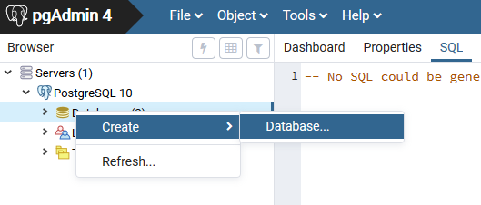

.. index::
   single: instalace

======================================
Poznámky k instalaci a obnově databáze
======================================

.. index::
   single: GNU/Linux

GNU/Linux
---------

Z distrubičního balíčku dané Linuxové distribuce.

.. index::
   single: Ubuntu
   single: Debian

Ubuntu / Debian
^^^^^^^^^^^^^^^

.. code-block:: bash

   apt-get install postgis

.. index::
   single: MS Windows

MS Windows
----------

Stáhněte a nainstalujte `PostgreSQL from EnterpriseDB
<http://www.enterprisedb.com/products-services-training/pgdownload>`_.

.. figure:: ../images/instalace-win-0.png
   :scale-latex: 70
              
   Zvolte 32 anebo 64bitovou verzi.

.. raw:: latex

   \newpage

.. figure:: ../images/instalace-win-1.png
   :width: 400px
   :scale-latex: 48
              
.. figure:: ../images/instalace-win-2.png
   :width: 400px
   :scale-latex: 48
              
   Určete adresář na disku, kam se PostgreSQL nainstaluje.

.. figure:: ../images/instalace-win-3.png
   :width: 400px
   :scale-latex: 48
              
   V dalším kroku zvolte adresář, kam se budou ukládat uživatelská
   data (mohou být velká podle toho k čemu budete databázi využívat).

Spusťte nástroj *StackBuilder* a z něho doinstalujte PostGIS.
      
.. figure:: ../images/instalace-win-5.png
   :width: 400px
   :scale-latex: 48

.. raw:: latex

   \newpage

.. figure:: ../images/instalace-win-6.png
   :width: 400px
   :scale-latex: 48
              
   Zvolíme databázový server, do kterého chceme doinstalovat PostGIS.

.. figure:: ../images/instalace-win-7.png
   :width: 400px
   :scale-latex: 48
              
   V prostředí Stack Builderu v sekci Spatial Extensions zvolíme verzi
   PostGIS podle toho, zda jste nainstalovali 32 anebo 64bitovou verzi
   PostgreSQL.

.. figure:: ../images/instalace-win-8.png
   :width: 400px
   :scale-latex: 48
   
.. figure:: ../images/instalace-win-9.png
   :width: 400px
   :scale-latex: 48

.. raw:: latex

   \newpage
                 
.. figure:: ../images/instalace-win-10.png
   :width: 400px
   :scale-latex: 48
              
   Adresář s nainstalovaným PostgreSQL by měl instalátor detekován
   automaticky.

.. noteadvanced::

   V PostGIS lze pracovat i s rastrovými daty, viz :skoleni:`školení
   PostGIS pro pokročilé
   <postgis-pokrocily/kapitoly/9_rastry.html>`. Pokud plánujeme
   pracovat i s rastrovými daty v databázi PostGIS musíme tuto
   funkcionalitu aktivovat již při instalaci.

   .. figure:: ../images/instalace-win-11.png
      :width: 400px
      :scale-latex: 48
              
   .. figure:: ../images/instalace-win-12.png
      :width: 400px
      :scale-latex: 48
                 
   .. figure:: ../images/instalace-win-13.png
      :width: 400px
      :scale-latex: 48
                 
Po úspěšné instalaci PostgreSQL a PostGIS doporučujeme nainstalovat
také aplikaci `PgAdmin <http://www.pgadmin.org>`_, pomocí kterého lze
naimportovat testovací databázi GISMentors.

.. raw:: latex

   \newpage

.. index::
   single: databáze GISMentors

Import databáze GISMentors
--------------------------

Soubor ke stažení: http://training.gismentors.eu/geodata/postgis/gismentors.dump

Databázi GISMentors lze naimportovat z grafické aplikace PgAdmin anebo
z příkazové řádky.

.. index::
   single: pgadmin

PgAdmin
^^^^^^^

	      
   Po připojení k databázovému serveru vytvoříme novou databázi.

.. figure:: ../images/restore-db-2.png
   :width: 400px
   :scale-latex: 40
              
   Databázi nazveme "gismentors".

.. raw:: latex

   \newpage
   
.. figure:: ../images/restore-db-3.png
   :scale-latex: 50
		 
   Z kontextového menu nad databázi zvolíme funkci "Obnovit".

.. figure:: ../images/restore-db-4.png
   :scale-latex: 60
              
   V dialogu pro výběr souboru zvolíme dávku "gismentors.dump" (je
   potřeba nastavit masku na "Všechny soubory").

.. figure:: ../images/restore-db-5.png
   :width: 400px   
   :scale-latex: 45

.. figure:: ../images/restore-db-6.png

   V sekci "Volby obnovení" zaškrtěte "Nekládat - vlastník".

.. important:: Tato volba je důležitá, jinak skončí import chybou!

.. figure:: ../images/restore-db-7.png
   :scale-latex: 55
              
Z příkazové řádky
^^^^^^^^^^^^^^^^^            

.. code-block:: bash

   wget http://training.gismentors.eu/geodata/postgis/gismentors.dump
   createdb gismentors
   pg_restore gismentors.dump | psql gismentors

Kompletní skript pro Bash ke stažení `zde
<https://raw.githubusercontent.com/GISMentors/dataset/master/postgis/create_db_from_dump.sh>`_.
