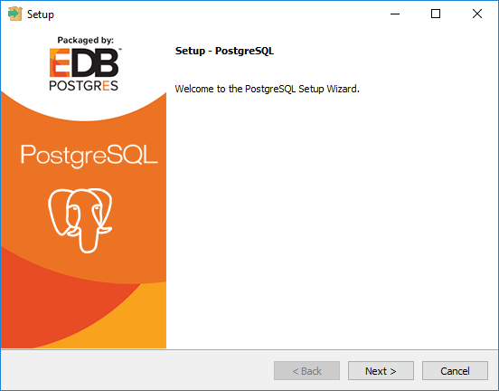
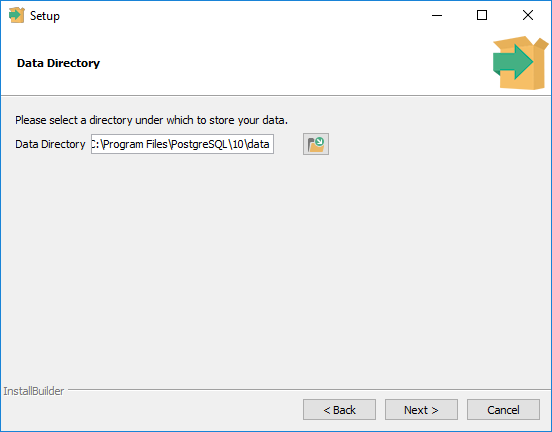
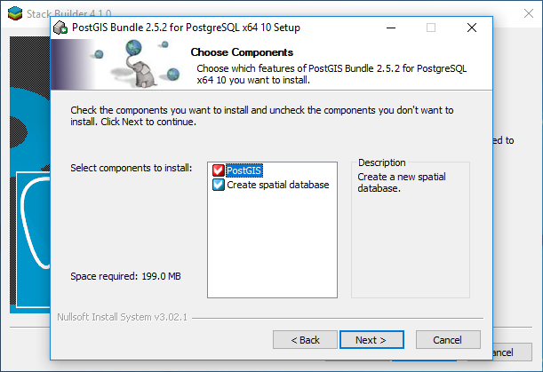
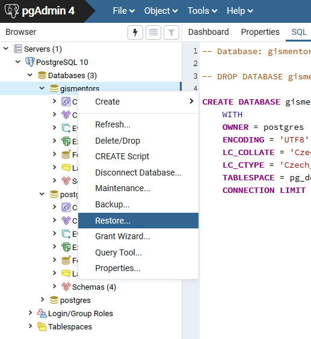
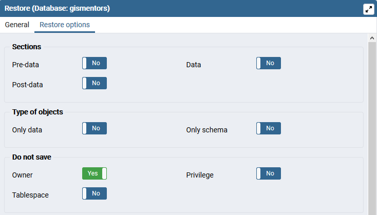

====================
Poznámky k instalaci
====================

.. todo:: Rozpracováno...
          
GNU/Linux
---------

Z distrubičního balíčku dané Linuxové distribuce.

Ubuntu / Debian
^^^^^^^^^^^^^^^

.. code-block:: bash

   apt-get install postgis

MS Windows
----------

1. Stáhněte a nainstalujte `PostgreSQL from EnterpriseDB
   <http://www.enterprisedb.com/products-services-training/pgdownload>`.
1. Spusťte nástroj *StackBuilder* a z něho doinstalujte PostGIS.

.. figure:: ../images/instalace-win-2.png

.. figure:: ../images/instalace-win-3.png

.. figure:: ../images/instalace-win-5.png

.. figure:: ../images/instalace-win-6.png

.. figure:: ../images/instalace-win-7.png

.. figure:: ../images/instalace-win-8.png

.. figure:: ../images/instalace-win-9.png

.. figure:: ../images/instalace-win-10.png

.. figure:: ../images/instalace-win-11.png

Obnova databáze GISMentors
--------------------------

GNU/Linux
^^^^^^^^^

.. todo::
   
MS Windows
^^^^^^^^^^

.. figure:: ../images/restore-db-1.png

.. figure:: ../images/restore-db-2.png

.. figure:: ../images/restore-db-4.png

.. figure:: ../images/restore-db-5.png

                      
