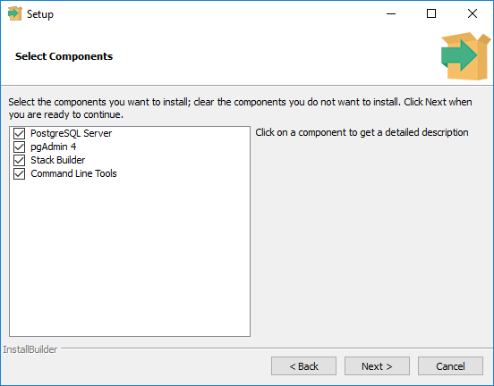
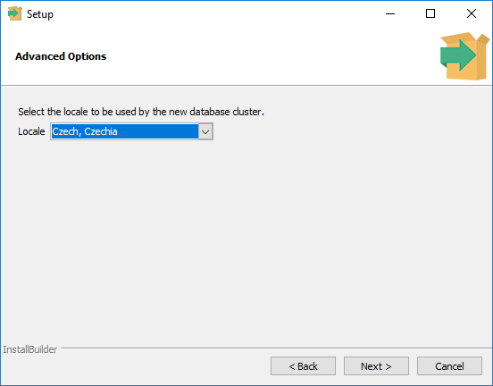

======================================
Poznámky k instalaci a obnově databáze
======================================

GNU/Linux
---------

Z distrubičního balíčku dané Linuxové distribuce.

Ubuntu / Debian
^^^^^^^^^^^^^^^

.. code-block:: bash

   apt-get install postgis

MS Windows
----------

Stáhněte a nainstalujte `PostgreSQL from EnterpriseDB
<http://www.enterprisedb.com/products-services-training/pgdownload>`_.

.. figure:: ../images/instalace-win-0.png
   
   Zvolte 32 anebo 64bitovou verzi.

.. figure:: ../images/instalace-win-1.png
   :width: 400px
        
.. figure:: ../images/instalace-win-2.png
   :width: 400px
        
   Určete adresář na disku, kam se PostgreSQL nainstaluje.

   V dalším kroku zvolte adresář, kam se budou ukládat uživatelská
   data (mohou být velká podle toho k čemu budete databázi využívat).

.. figure:: ../images/instalace-win-4.png
   :width: 400px

Spusťte nástroj *StackBuilder* a z něho doinstalujte PostGIS.
      
.. figure:: ../images/instalace-win-5.png
   :width: 400px
        
.. figure:: ../images/instalace-win-6.png
   :width: 400px

   Zvolíme databázový server, do kterého chceme doinstalovat PostGIS.

   V prostředí Stack Builderu v selci Spatial Extensions zvolíme verzi
   PostGIS podle toho, zda jste nainstalovali 32 anebo 64bitovou verzi
   PostgreSQL.

.. figure:: ../images/instalace-win-8.png
   :width: 400px
        
.. figure:: ../images/instalace-win-9.png
   :width: 400px
        
.. figure:: ../images/instalace-win-10.png
   :width: 400px

   Adresář s nainstalovaným PostgreSQL by měl instalátor detekován
   automaticky.

.. noteadvanced::

   V PostGIS lze pracovat i s rastrovými daty, viz :skoleni:`PostGIS
   pro pokrocilé <postgis-pokrocily>`. Pokud plánujeme pracovat i s
   rastrovými daty v databázi PostGIS musíme tuto funkcionalitu
   aktivovat už při instalaci.

   .. figure:: ../images/instalace-win-11.png
      :width: 400px
        
   .. figure:: ../images/instalace-win-12.png
      :width: 400px
   
   .. figure:: ../images/instalace-win-13.png
      :width: 400pxx
        
.. figure:: ../images/instalace-win-14.png
   :width: 400px

Po úspěšné instalaci PostgreSQL a PostGIS doporučujeme nainstalovat
také aplikaci `PgAdmin 3 <http://www.pgadmin.org>`_, pomocí které
naimportujeme testovací databázi GISMentors.
           
Obnova databáze GISMentors
--------------------------

Soubor ke stažení: http://training.gismentors.eu/geodata/postgis/gismentors.dump

PgAdmin 3
^^^^^^^^^

.. figure:: ../images/restore-db-1.png

   Po připojení k databázovému serveru vytvoříme novou databázi.

.. figure:: ../images/restore-db-2.png
   :width: 400px
        
   Databázi nazveme "gismentors".

.. figure:: ../images/restore-db-3.png

   Z kontextového menu nad databázi zvolíme funkci "Obnovit".

.. figure:: ../images/restore-db-4.png

   V dialogu pro výběr souboru zvolíme dávku "gismentors.dump" (je
   potřeba nastavit masku na "Všechny soubory").

.. figure:: ../images/restore-db-5.png
   :width: 400px   

.. figure:: ../images/restore-db-6.png

   V sekci "Volby obnovení" zaškrtěte "Nekládat - vlastník".

.. warning:: Tato volba je důležitá, jinak skončí import chybou!

Z příkazové řádky
^^^^^^^^^^^^^^^^^            

Pro Bash:

.. code-block:: bash

   createdb gismentors
   pg_restore gismentors.dump | psql gismentors

Kompletní skript pro Bash `zde
<https://raw.githubusercontent.com/GISMentors/dataset/master/postgis/create_gismentors.sh>`_.
