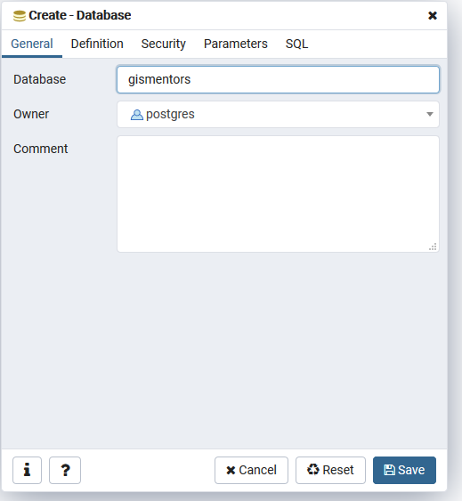
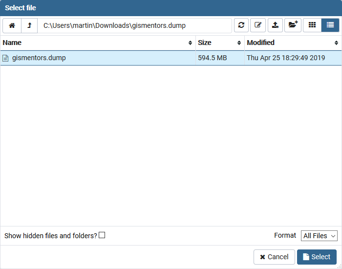
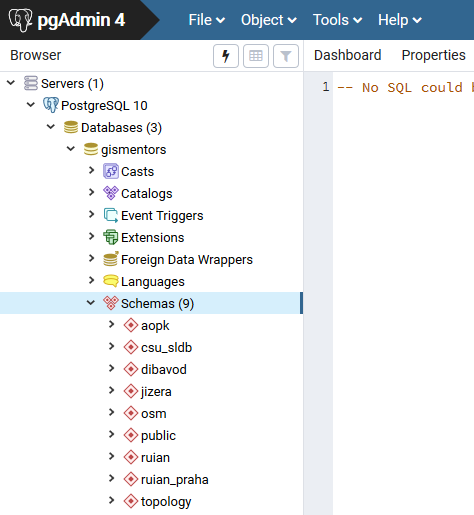

.. index::
   single: instalace

======================================
Poznámky k instalaci a obnově databáze
======================================

.. index::
   single: GNU/Linux

GNU/Linux
---------

Z distrubičního balíčku dané Linuxové distribuce.

.. index::
   single: Ubuntu
   single: Debian

Ubuntu / Debian
^^^^^^^^^^^^^^^

.. code-block:: bash

   apt-get install postgis

.. index::
   single: MS Windows

MS Windows
----------

Ukážeme si doporučený postup instalace pomocí `PostgreSQL from
EnterpriseDB
<http://www.enterprisedb.com/products-services-training/pgdownload>`__
instalátoru.

.. figure:: ../images/instalace-win-0.png
   :scale-latex: 70
   :class: middle
              
   Zvolíme verzi PostgreSQL k instalaci.

.. note:: Instalátor může ještě před svým startem vynutit instalaci
   *Microsoft Visual C++ Redistributable*, pokud není na hostitelském
   počítači dostupný.
          
.. raw:: latex

   \newpage

.. figure:: ../images/instalace-win-1.png
   :width: 400px
   :scale-latex: 48
              

              
   Určíme adresář na disku, kam se PostgreSQL nainstaluje.

.. figure:: ../images/instalace-win-3.png
   :width: 400px
   :scale-latex: 48

   Doporučujeme nainstalovat všechny kompomenty včetně konzolových
   nástrojů a PgAdmin 4. Stack Builder je nutností pro navazující
   instalaci PostGIS.
   
.. figure:: ../images/instalace-win-4.png
   :width: 400px
   :scale-latex: 48
                 
   V dalším kroku zvolíme adresář, kam se budou ukládat uživatelská
   data (mohou být velká podle toho k čemu budete databázi využívat).

.. _pg_admin_passwd:

.. figure:: ../images/instalace-win-5.png
   :width: 400px
   :scale-latex: 48

.. figure:: ../images/instalace-win-6.png
   :width: 400px
   :scale-latex: 48

   Nastavíme heslo administrátora a port, na kterém databázový server
   poběží.

.. figure:: ../images/instalace-win-7.png
   :width: 400px
   :scale-latex: 48

   Doporučujeme nastavit locales. Instalaci dokončíme, dalším krokem
   bude instalace PostGIS.

.. figure:: ../images/instalace-win-9.png
   :width: 400px
   :scale-latex: 48
                 
   Nástroj *StackBuilder* se spustí automaticky.
      
.. figure:: ../images/instalace-win-10.png
   :width: 400px
   :scale-latex: 48

   Zvolíme databázový server, do kterého chceme doinstalovat PostGIS.

.. figure:: ../images/instalace-win-11.png
   :width: 400px
   :scale-latex: 48
   
   V prostředí Stack Builderu v sekci Spatial Extensions zvolíme verzi
   PostGIS podle toho, zda jste nainstalovali 32 anebo 64bitovou verzi
   PostgreSQL. Adresář s nainstalovaným PostgreSQL by měl instalátor
   detekován automaticky.

.. figure:: ../images/instalace-win-12.png
   :width: 400px
   :scale-latex: 48

.. figure:: ../images/instalace-win-13.png
   :width: 400px
   :scale-latex: 48

   Volitelně můžete vytvořit databázi PostGIS se vzorovými daty. Tento
   krok není ale nutný.

   Před samotnou instalací PostGIS musíme zadat již dříve definováné
   administrátorské heslo, viz :numref:`pg_admin_passwd`.
   
.. note::

   V PostGIS lze pracovat i s rastrovými daty, viz :skoleni:`školení
   PostGIS pro pokročilé
   <postgis-pokrocily/kapitoly/9_rastry.html>`. Pokud plánujeme s
   takovými daty pracovat, tak musíme tuto funkcionalitu aktivovat již
   při instalaci PostGIS.

   .. figure:: ../images/instalace-win-16.png
      :scale-latex: 48
      :class: small
              
   .. figure:: ../images/instalace-win-17.png
      :scale-latex: 48
      :class: small
              
   .. figure:: ../images/instalace-win-18.png
      :scale-latex: 48
      :class: small
              
Po úspěšné instalaci PostgreSQL a PostGIS spustíme aplikaci *PgAdmin 4*,
pomocí které lze naimportovat školící databázi GISMentors.

.. raw:: latex

   \newpage

.. index::
   single: databáze GISMentors

Import databáze GISMentors
--------------------------

Soubor ke stažení: http://training.gismentors.eu/geodata/postgis/gismentors.dump

Databázi GISMentors lze naimportovat z grafické aplikace PgAdmin 4
anebo z příkazové řádky.

.. index::
   single: pgadmin

PgAdmin
^^^^^^^

.. figure:: ../images/restore-db-1.png
   :scale-latex: 45
   :class: small
   
   Po připojení k databázovému serveru vytvoříme novou databázi.

              
   Databázi nazveme "gismentors".

.. raw:: latex

   \newpage
   
.. figure:: ../images/restore-db-3.png
   :scale-latex: 50
   :class: small
	   
   Z kontextového menu nad databázi zvolíme funkci "Obnovit".

              
.. figure:: ../images/restore-db-5.png
   :width: 400px   
   :scale-latex: 45

   V dialogu pro výběr souboru zvolíme dávku "gismentors.dump" (je
   potřeba nastavit masku na "All files").

.. figure:: ../images/restore-db-6.png

   V sekci "Volby obnovení" zaškrtěte "Do not save - owner".

.. important:: Tato volba je důležitá, jinak skončí import chybou!

              
Z příkazové řádky
^^^^^^^^^^^^^^^^^            

.. code-block:: bash

   wget http://training.gismentors.eu/geodata/postgis/gismentors.dump
   createdb gismentors
   pg_restore gismentors.dump | psql gismentors

Kompletní skript pro Bash ke stažení `zde
<https://raw.githubusercontent.com/GISMentors/dataset/master/postgis/create_db_from_dump.sh>`_.
